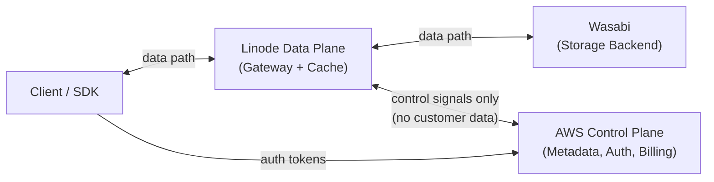
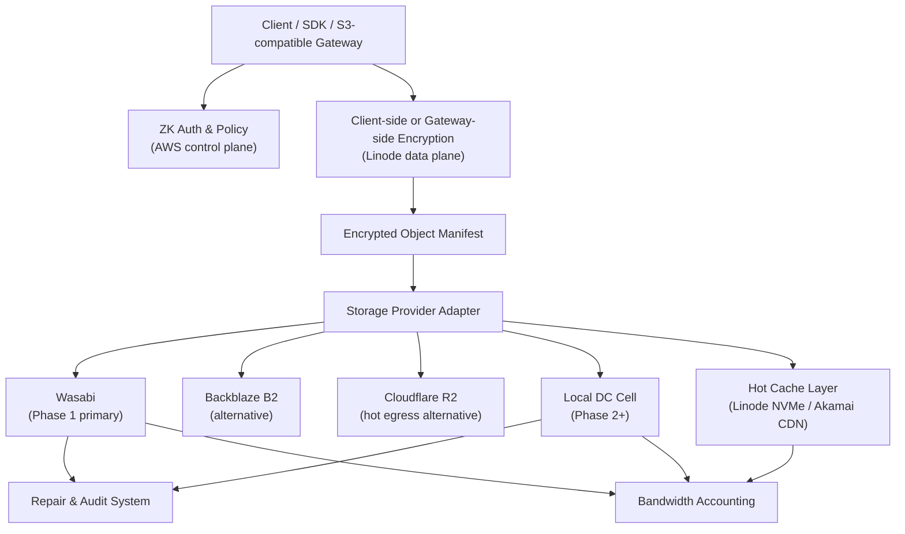

# ZK Object Fabric

> Zero-knowledge, S3-compatible object storage with customer-controlled
> placement, provider-neutral durability, and cache-aware egress pricing.
> Start on public cloud, migrate to dedicated storage cells.

## What it is

ZK Object Fabric is a multi-tenanted, portable encrypted object fabric
that sits between customers and storage backends. It encrypts data
client-side by default, stores ciphertext across pluggable storage
providers (Wasabi, Linode, AWS, local DC cells), and serves hot reads
from a regional cache — all behind an S3-compatible API.

The fabric is designed to **start on public cloud** and migrate to
**owned infrastructure** without changing customer-facing APIs. The same
SDK, bucket name, object key, and URL work across every phase.

It serves two audiences:

- **B2C / self-service** app developers who need cheap, zero-knowledge,
  S3-compatible storage they can onboard via an SDK and an API key.
- **B2B / enterprise / sovereign** customers who need dedicated cells,
  country / DC / rack-level placement control, committed bandwidth, and
  SLA-backed durability.

## Key differentiators

- **Zero-knowledge by default** — client-side encryption, per-object
  DEKs, encrypted manifests. The service operator cannot read customer
  data.
- **Provider-neutral object manifests** — customer objects are
  decoupled from backend provider objects.
- **Pluggable storage backends** — Wasabi, Backblaze B2, Cloudflare R2,
  AWS S3, local DC cells.
- **Built-in migration engine** — cloud → hybrid → local DC with zero
  customer-facing API changes.
- **Customer-controlled placement** — provider, region, country; plus
  DC / rack / node when on owned infrastructure.
- **Three-layer data plane** — L0 edge cache, L1 regional hot replica,
  L2 durable origin.
- **Explicit bandwidth accounting** — no hidden "fair-use" policies;
  egress is metered and priced transparently.
- **Multi-tenant** — per-tenant encryption, placement policies, egress
  budgets, billing counters, and abuse controls.
- **Cell architecture for horizontal scale** — independent cells of
  2–20 PB usable capacity in the local DC phase, each with its own
  metadata, repair queues, and failure domains.
- **Two deployment modes** — B2C self-service on pooled infrastructure
  and B2B dedicated cells for sovereign / PB+ customers.

## Phase 1 Architecture — AWS + Linode + Wasabi

Phase 1 splits the system into three clearly separated components so
that customer data **never transits AWS** and therefore never incurs
AWS egress fees.

- **AWS (Control Plane)** — metadata DB (Postgres / RDS), auth / IAM,
  billing counters, monitoring, alerting, operational dashboards.
  **No customer data flows through AWS.**
- **Linode (Data Plane)** — S3-compatible gateway fleet, hot object
  cache, CDN integration. **All customer data flows through Linode
  nodes only.**
- **Wasabi (Storage Backend)** — durable object storage at
  ~$6.99 / TB-mo with fair-use included egress. Primary durable origin
  for encrypted chunks/objects in Phase 1.

Data flow:



Why this works:

- Wasabi is the cheapest S3-compatible storage backend (~$6.99 / TB-mo)
  with included egress under a fair-use policy (monthly egress
  ≤ active storage volume).
- Linode provides the data plane with predictable bandwidth pricing and
  an included transfer allowance per node, which is ideal for
  caching hot ciphertext in front of Wasabi.
- AWS provides an enterprise-grade control plane (RDS, IAM, CloudWatch)
  without incurring data egress costs — because no customer data
  transits AWS.
- The Linode cache layer absorbs repeated reads, keeping Wasabi origin
  egress within fair-use bounds.

## Phased strategy

- **Phase 1 — Public Cloud Origin**: AWS control plane + Linode data
  plane + Wasabi storage. Prove the ZK storage layer, S3 API, client
  SDK, placement policy, billing, hot cache, migration engine, and
  operational telemetry.
- **Phase 2 — Hybrid Local Primary**: add local DC cells for new
  writes. Linode + Wasabi continue as backup and overflow. Dual-write,
  lazy migration on read, background rebalancer.
- **Phase 3 — In-Country Storage Cells**: local erasure-coded HDD
  origin, NVMe cache, DC / rack / node placement. Cloud only for DR,
  migration, and burst. This is where ZK Object Fabric achieves cost
  leadership.

## Architecture (full system view)



All layers below the ZK Gateway operate on ciphertext. Keys never leave
the client boundary unless the customer explicitly opts into a managed
key mode.

## Zero-knowledge modes

| Mode                | Product name                | Who holds keys                              | Use case                              |
| ------------------- | --------------------------- | ------------------------------------------- | ------------------------------------- |
| Strict ZK           | ZK Storage                  | Customer                                    | Security-sensitive B2B                |
| Managed Encrypted   | Managed Secure Storage      | Gateway or HSM-backed service               | Simpler B2C and SMB                   |
| Public Distribution | Edge Object                 | Object may be public but origin encrypted   | Assets, media, downloads              |

> **Note**: Managed encrypted mode is **not** strict zero-knowledge.
> The gateway can access plaintext in memory during request handling.
> This mode should be called **confidential managed storage**, not
> zero-knowledge, in customer-facing documentation.

## Product tiers by phase

### Phase 1 — Public Cloud (AWS + Linode + Wasabi)

| Product               | Backend                          | Suggested retail          | Positioning                                  |
| --------------------- | -------------------------------- | ------------------------- | -------------------------------------------- |
| ZK Beta               | Wasabi via Linode                | $9.99–$14.99 / TB-mo      | Privacy premium over Wasabi direct           |
| ZK Hot                | Wasabi + Linode cache / CDN      | $14.99–$19.99 / TB-mo     | High egress, CDN, frequent reads             |
| BYOC Control Plane    | Customer's own cloud account     | SaaS fee + usage          | Best for early enterprise                    |
| Migration Layer       | Customer cloud → local DC        | Project or usage fee      | Builds future local storage demand           |

### Phase 2 — Hybrid (local DC primary + Wasabi / cloud DR)

| Product                  | Backend                         | Suggested retail       |
| ------------------------ | ------------------------------- | ---------------------- |
| ZK Standard              | Local primary + Wasabi DR       | $6.99–$8.99 / TB-mo    |
| ZK Standard (Strict)     | Local EC + customer keys        | $7.99–$11.99 / TB-mo   |
| ZK Hot                   | Local cache + CDN               | $9.99–$19.99 / TB-mo   |
| Dedicated PB Cell        | Reserved local capacity         | Custom                 |

### Phase 3 — Local DC

| Product         | Backend                                  | Possible retail target |
| --------------- | ---------------------------------------- | ---------------------- |
| ZK Archive      | Local HDD EC                             | $2.99–$4.99 / TB-mo    |
| ZK Standard     | Local HDD EC + limited egress            | $4.99–$6.99 / TB-mo    |
| ZK Hot          | Local EC + NVMe cache + replica          | $7.99–$12.99 / TB-mo   |
| ZK Sovereign    | Reserved racks or nodes                  | Contracted             |

## Deployment modes

### B2C / Self-service

- Pooled infrastructure shared across many tenants.
- Automated onboarding: sign up, create bucket, receive API keys.
- SDK-driven encryption so tenants never ship plaintext keys to the
  service.
- Per-tenant egress budgets and anomaly detection.
- Abuse controls (rate limits, reputation, optional CDN shielding).
- Starts on public cloud (AWS control plane + Linode data plane +
  Wasabi storage) and migrates to owned nodes as a tenant's footprint
  grows.

### B2B / Dedicated

- Dedicated cells with isolated metadata, repair, and billing.
- Sovereign placement (specific countries, DCs, racks, node classes).
- Committed bandwidth contracts, not best-effort egress.
- Custom erasure coding profiles per cell.
- SLA-backed durability and availability.
- Scales to owned high-density HDD storage nodes for PB+ footprints.

## Tech stack

- **Server-side**: **Go** for the ZK Gateway, control plane services,
  storage provider adapters, migration engine, billing, and metadata
  services.
- **Frontend**: **React** for the tenant console, admin dashboards,
  self-service onboarding, and operator UIs.
- **Rust** is used **selectively** where it makes a large difference —
  chunking and encryption hot paths, cache eviction loops, erasure
  coding in Phase 2+, and any node-local agent where memory footprint
  and per-byte CPU cost matter.

## Target repo structure

```
zk-object-fabric/
  api/s3_compat/
  encryption/
    client_sdk/
    envelope_keys/
    chunk_crypto/
  metadata/
    manifest_store/
    object_versions/
    placement_policy/
  providers/
    s3_generic/
    wasabi/
    aws_s3/
    backblaze_b2/
    cloudflare_r2/
    local_fs_dev/
  cache/
    hot_object_cache/
    range_cache/
  migration/
    dual_write/
    background_rebalancer/
    lazy_read_repair/
  billing/
    storage_metering/
    egress_metering/
    request_metering/
  tests/
    s3_compat/
    chaos/
    migration/
    cost_model/
```

## Storage provider interface

All backends (Wasabi, Backblaze B2, Cloudflare R2, AWS S3, local DC
cell) implement the same interface so the fabric can add, remove, and
migrate between backends without customer-visible changes.

```typescript
interface StorageProvider {
  putPiece(pieceId: string, data: ReadableStream, opts: PutOptions): Promise<PutResult>;
  getPiece(pieceId: string, range?: ByteRange): Promise<ReadableStream>;
  headPiece(pieceId: string): Promise<PieceMetadata>;
  deletePiece(pieceId: string): Promise<void>;
  listPieces(prefix: string, cursor?: string): Promise<ListResult>;
  capabilities(): ProviderCapabilities;
  costModel(): ProviderCostModel;
  placementLabels(): PlacementLabels;
}
```

The Go implementation uses the equivalent interface; the TypeScript
signature above is the canonical reference for documentation.

## What NOT to build first

The following items are explicitly **out of scope for Phase 1 and
Phase 2**. They are tempting, but any of them will slow the product
down without materially improving the value proposition.

- Full decentralized node reputation system.
- Storj-style satellite complexity.
- Public token incentives.
- Multi-cloud erasure coding.
- Custom distributed filesystem.
- Full Ceph fork.
- Ceph on EC2 / EBS.

The early fabric is: S3 API at the edge, ZK encryption, provider-
neutral manifests, Wasabi as the primary durable backend, and a Linode
cache in front of it.

## Project status

- **Current phase**: Phase 1 — Architecture Proof.
- **Tracker**: [docs/PROGRESS.md](docs/PROGRESS.md).
- **Technical proposal**: [docs/PROPOSAL.md](docs/PROPOSAL.md).

## License

Proprietary — All Rights Reserved. See [LICENSE](LICENSE) for details.
