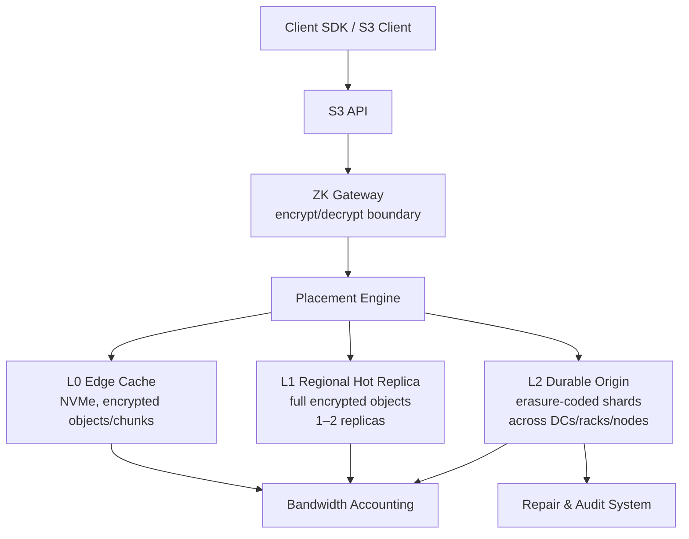

# Uney ZK Object Fabric

> Zero-knowledge, S3-compatible object storage with customer-controlled placement, erasure-coded durability, and cache-aware egress pricing.

## What it is

Uney ZK Object Fabric is a multi-tenanted object storage fabric that encrypts
data client-side by default, erasure-codes it across controlled storage nodes,
and serves hot reads from regional cache — all behind an S3-compatible API.

It is designed for two audiences:

- **B2C / self-service** app developers who need cheap, zero-knowledge,
  S3-compatible storage they can onboard via an SDK and an API key.
- **B2B / enterprise / sovereign** customers who need dedicated cells,
  country/DC/rack-level placement control, committed bandwidth, and
  SLA-backed durability.

The fabric starts small on public cloud and leased servers and scales to
dedicated high-density HDD storage nodes as volume grows.

## Key differentiators

- **Zero-knowledge by default** — client-side encryption, per-object DEKs,
  encrypted manifests. The service operator cannot read customer data.
- **Customer-controlled placement** — country, region, DC, rack, node
  class, and disk class are first-class policy inputs.
- **Erasure-coded durable origin** — 8+3 or 10+4 Reed–Solomon across
  controlled nodes, not Storj's 80/29 profile tuned for untrusted peers.
- **Three-layer data plane** — L0 edge cache, L1 regional hot replica,
  L2 EC durable origin.
- **Explicit bandwidth accounting** — no hidden "fair-use" policies;
  egress is metered and priced transparently.
- **Multi-tenant** — per-tenant encryption, placement policies, egress
  budgets, billing counters, and abuse controls.
- **Cell architecture for horizontal scale** — independent cells of
  2–20 PB usable capacity, each with its own metadata, repair queues,
  and failure domain.
- **Two deployment modes** — B2C self-service on pooled infrastructure
  and B2B dedicated cells for sovereign / PB+ customers.

## Architecture

All layers below the ZK Gateway operate on ciphertext. Keys never leave
the client boundary unless the customer explicitly opts into a managed
key mode.

## Product tiers

| Tier          | Storage Price        | Included Egress    | Backend                         | Target                           |
| ------------- | -------------------- | ------------------ | ------------------------------- | -------------------------------- |
| ZK Archive    | $2.99–$4.99 / TB-mo  | Low / none         | 10+4 EC, HDD                    | Backup, compliance               |
| ZK Standard   | $4.99–$5.99 / TB-mo  | 1× stored          | 8+3 or 10+4 EC                  | Wasabi / B2 replacement          |
| ZK Hot        | $6.99–$9.99 / TB-mo  | 2–5× if cacheable  | EC + regional replicas          | SaaS assets, frequent reads      |
| ZK Dedicated  | Custom               | Committed BW       | Dedicated cell                  | PB+ customers                    |
| ZK Sovereign  | Premium              | Contractual        | Country / DC / rack-constrained | Regulated customers              |

## Deployment modes

### B2C / Self-service

- Pooled infrastructure shared across many tenants.
- Automated onboarding: sign up, create bucket, receive API keys.
- SDK-driven encryption so tenants never ship plaintext keys to the service.
- Per-tenant egress budgets and anomaly detection.
- Abuse controls (rate limits, reputation, optional CDN shielding).
- Starts on public cloud and leased servers; migrates to owned nodes as
  a tenant's footprint grows.

### B2B / Dedicated

- Dedicated cells with isolated metadata, repair, and billing.
- Sovereign placement (specific countries, DCs, racks, node classes).
- Committed bandwidth contracts, not best-effort egress.
- Custom erasure coding profiles per cell.
- SLA-backed durability and availability.
- Scales to owned high-density HDD storage nodes for PB+ footprints.

## Open-source base

Uney ZK Object Fabric ships under a **proprietary license**. This rules
out AGPL-licensed projects as production bases. The viable bases are
permissively licensed and used as the storage and erasure-coding engine
underneath Uney's own ZK, placement, repair, billing, and cache layers.

- **Option A — Fastest**: [SeaweedFS](https://github.com/seaweedfs/seaweedfs)
  (Apache-2.0) as the base, with Uney encryption, placement, repair,
  billing, and cache layers built on top.
- **Option B — Most production-grade**: [Ceph RGW](https://docs.ceph.com/en/latest/radosgw/)
  (LGPL-2.1) as the base, with Uney ZK gateway, placement abstraction,
  cache layer, and policy API on top.

> **Note**: Storj and MinIO are AGPL-licensed. They are **study / reference
> only** and cannot be used as a production base because the combination
> would conflict with Uney's proprietary licensing.

See [docs/PROPOSAL.md](docs/PROPOSAL.md) for the full open-source base
assessment, including Garage, Tahoe-LAFS, and RustFS.

## Quick start

The project is currently in **Phase 1 — Architecture Proof**. There is no
runnable quick start yet.

- Technical proposal: [docs/PROPOSAL.md](docs/PROPOSAL.md)
- Phase-gated progress tracker: [docs/PROGRESS.md](docs/PROGRESS.md)

Phase 2 will deliver a prototype S3 gateway, encryption SDK, placement
engine, and durable EC origin. See PROGRESS.md for the checklist.

## Project status

- **Current phase**: Phase 1 — Architecture Proof
- **Tracker**: [docs/PROGRESS.md](docs/PROGRESS.md)

## License

Proprietary — All Rights Reserved. See [LICENSE](LICENSE) for details.
