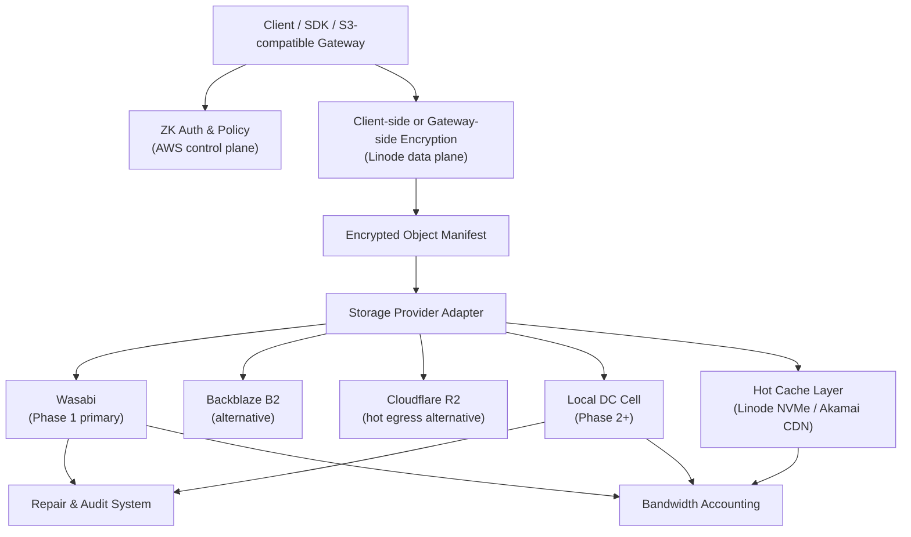

# ZK Object Fabric

> Zero-knowledge, S3-compatible object storage with customer-controlled
> placement, provider-neutral durability, and cache-aware egress pricing.
> Start on public cloud, migrate to dedicated storage cells.

## Overview

ZK Object Fabric is a multi-tenanted, portable encrypted object fabric
that sits between customers and storage backends. It encrypts data
client-side by default, stores ciphertext across pluggable storage
providers (Wasabi, Linode, AWS, local DC cells), and serves hot reads
from a regional cache — all behind an S3-compatible API.

The fabric is designed to start on public cloud and migrate to owned
infrastructure without changing customer-facing APIs. The same SDK,
bucket name, object key, and URL work across every phase.

## Quick Start (Docker)

The gateway runs as a single container with **zero external
dependencies** — no Postgres, no ClickHouse, no cloud credentials.
It uses the `local_fs_dev` filesystem backend, in-memory manifests,
and the logger billing sink.

```bash
docker compose up --build
```

| Port    | Service           |
| ------- | ----------------- |
| `:8080` | S3-compatible API |
| `:8081` | Console API       |

Demo tenant credentials (pre-loaded from `demo/tenants.json`):

| Field        | Value              |
| ------------ | ------------------ |
| Access Key   | `demo-access-key`  |
| Secret Key   | `demo-secret-key`  |

Try it with the AWS CLI:

```bash
aws --endpoint-url http://localhost:8080 s3 mb s3://mybucket
aws --endpoint-url http://localhost:8080 s3 cp myfile.txt s3://mybucket/
aws --endpoint-url http://localhost:8080 s3 ls s3://mybucket/
```

Any S3-compatible client (AWS SDK, MinIO client, boto3) works.

Reference integrations for mail, file sync, ERP, and messaging are
included in the demo configuration; see
[`demo/README.md`](demo/README.md).

> **Note**: tenant and manifest state is in-memory and lost on
> container restart. Object data persists in the `zk-data` Docker
> volume. This mode is for development and demos only.

## Running Tests

```bash
# Unit and integration tests (uses in-memory backends)
go test ./...

# S3 compliance suite only
go test ./tests/s3_compat/ -v

# Benchmark suite
go test ./tests/benchmark/ -v

# Frontend e2e tests (requires running gateway)
cd frontend && npx playwright test
```

Environment-gated tests (Ceph RGW, Wasabi, Storj, etc.) require
provider credentials via environment variables. See
`tests/s3_compat/suite_test.go` for the gating pattern.

## Key Features

- **S3 API as the stable contract** — the S3-compatible API surface is
  frozen across phases. Backend storage, encryption, caching, and
  erasure coding evolve underneath; the API never changes.
- **Zero-knowledge by default** — client-side encryption, per-object
  DEKs, encrypted manifests. The service operator cannot read customer
  data in Strict ZK mode.
- **Provider-neutral object manifests** — customer object names are
  decoupled from backend locators, enabling seamless migrations.
- **Pluggable storage backends** — Wasabi, Backblaze B2, Cloudflare R2,
  AWS S3, Storj, and local DC cells.
- **Built-in migration engine** — cloud → hybrid → local DC with no
  customer-facing API changes.
- **Customer-controlled placement** — provider, region, country; plus
  DC / rack / node when on owned infrastructure.
- **Three-layer data plane** — L0 edge cache, L1 regional hot replica,
  L2 durable origin.
- **Multi-tenant** — per-tenant encryption, placement policies, egress
  budgets, billing counters, and abuse controls.
- **Intra-tenant deduplication** — object-level dedup across all
  backends plus block-level dedup on Ceph RGW cells. See
  [docs/INTEGRATION.md](docs/INTEGRATION.md) for the external app
  integration guide.
- **Cell architecture for horizontal scale** — independent cells of
  2–20 PB usable capacity, each with its own metadata, repair queues,
  and failure domains.

## Architecture Overview


```mermaid
flowchart TD
    Client["Client / SDK / S3-compatible Gateway"]
    Auth["ZK Auth &amp; Policy<br/>(AWS control plane)"]
    Enc["Client-side or Gateway-side Encryption<br/>(Linode data plane)"]
    Manifest["Encrypted Object Manifest"]
    Adapter["Storage Provider Adapter"]
    Wasabi["Wasabi<br/>(Phase 1 primary)"]
    B2["Backblaze B2<br/>(alternative)"]
    R2["Cloudflare R2<br/>(hot egress alternative)"]
    Local["Local DC Cell<br/>(Phase 2+)"]
    Cache["Hot Cache Layer<br/>(Linode NVMe / Akamai CDN)"]
    Repair["Repair &amp; Audit System"]
    Bw["Bandwidth Accounting"]

    Client --> Auth
    Client --> Enc
    Enc --> Manifest
    Manifest --> Adapter
    Adapter --> Wasabi
    Adapter --> B2
    Adapter --> R2
    Adapter --> Local
    Adapter --> Cache
    Cache --> Bw
    Wasabi --> Repair
    Local --> Repair
    Wasabi --> Bw
    Local --> Bw
```

All layers below the ZK Gateway operate on ciphertext. Keys never leave
the client boundary unless the customer explicitly opts into a managed
key mode.

For the full as-built architecture (component diagrams, package map,
data flow, deployment modes), see
[docs/ARCHITECTURE.md](docs/ARCHITECTURE.md).

## Zero-Knowledge Modes

| Mode                | Product name                | Who holds keys                              | Use case                              |
| ------------------- | --------------------------- | ------------------------------------------- | ------------------------------------- |
| Strict ZK           | ZK Storage                  | Customer                                    | Security-sensitive B2B                |
| Managed Encrypted   | Managed Secure Storage      | Gateway or HSM-backed service               | Simpler B2C and SMB                   |
| Public Distribution | Edge Object                 | Object may be public but origin encrypted   | Assets, media, downloads              |

Managed encrypted mode is not strict zero-knowledge — the gateway can
access plaintext in memory during request handling.

## Project Status

- **Current phase**: Phase 3 — Beta Cell (COMPLETE). Phase 3.5 —
  Intra-Tenant Deduplication (COMPLETE). Phase 4 — Production &
  Scale (IN PROGRESS).
- **Tracker**: [docs/PROGRESS.md](docs/PROGRESS.md).
- **Technical design**: [docs/PROPOSAL.md](docs/PROPOSAL.md).

## Documentation

- [docs/PROPOSAL.md](docs/PROPOSAL.md) — Technical design and architecture spec
- [docs/PROGRESS.md](docs/PROGRESS.md) — Phase-gated development progress
- [docs/PHASES.md](docs/PHASES.md) — Phase summary and status overview
- [docs/ARCHITECTURE.md](docs/ARCHITECTURE.md) — As-built architecture overview
- [docs/INTEGRATION.md](docs/INTEGRATION.md) — Dedup integration guide for external apps
- [docs/STORAGE_INFRA.md](docs/STORAGE_INFRA.md) — Deployment-model to storage mapping
- [docs/runbooks/](docs/runbooks/) — Operational runbooks (CMK rotation, tenant setup, beta onboarding, BYOC)

## License

Proprietary — All Rights Reserved. See [LICENSE](LICENSE) for details.
