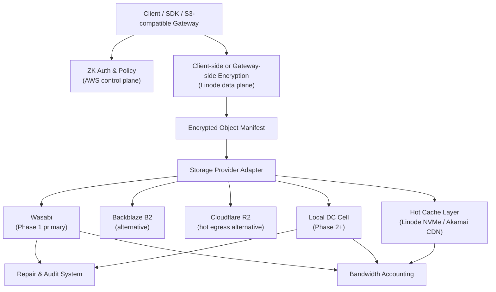

# ZK Object Fabric — As-Built Architecture

This document describes the system **as currently implemented** —
the directory layout, the components in each layer, the deployment
modes, and the wire-level contracts. It complements but does not
replace:

- [PROPOSAL.md](PROPOSAL.md) — full technical design (encryption
  envelope, manifest format, placement DSL, dedup design, migration
  engine, cell architecture).
- [STORAGE_INFRA.md](STORAGE_INFRA.md) — deployment-model →
  storage-backend mapping and provider adapter matrix.
- [INTEGRATION.md](INTEGRATION.md) — dedup integration patterns for
  external applications.
- [PHASES.md](PHASES.md) — phase summary and current status.
- [PROGRESS.md](PROGRESS.md) — detailed phase-gated checklist.

## High-level architecture



Every layer below the ZK Gateway operates on ciphertext. Keys never
leave the client boundary unless the customer explicitly opts into a
managed key mode.

## Tech stack

- **Server-side**: Go for the gateway, control plane services,
  storage provider adapters, migration engine, billing, and
  metadata services.
- **Frontend**: React + Vite + TypeScript for the tenant console,
  admin dashboards, self-service onboarding, and operator UIs
  (`frontend/`).
- **Rust** is reserved for selective hot paths where memory
  footprint and per-byte CPU cost dominate (chunking, encryption,
  cache eviction loops, erasure coding); not yet wired in the
  current build — Go covers the data plane for Phase 1 → Phase 4.
- **Datastores**: PostgreSQL for metadata (manifest, tenant, auth,
  placement, dedicated-cell, audit, legal hold, content index),
  ClickHouse for billing telemetry, Redis-style in-memory + on-disk
  LRU for hot object caching.
- **Crypto primitives**: XChaCha20-Poly1305 for object framing,
  BLAKE3 for content addressing, HKDF-SHA256 for convergent DEK
  derivation, AES-KW (via AWS KMS or Vault Transit) for CMK envelope
  wrap.

## Repository layout (as-built)

```
zk-object-fabric/
  Dockerfile
  docker-compose.yml
  go.mod / go.sum
  .dockerignore
  cmd/
    gateway/              # Gateway entry point (main.go)
  api/
    s3compat/             # S3 API handlers, multipart, dedup,
                          # erasure coding, encryption
    console/              # Console API: tenant mgmt, auth, billing,
                          # placement, dedup policy
  encryption/
    client_sdk/           # Client-side encryption SDK
                          # (XChaCha20-Poly1305, convergent DEK)
    envelope.go           # Encryption envelope types
  metadata/
    manifest_store/       # Manifest persistence (memory + Postgres)
    placement_policy/     # Placement engine and policy DSL
    erasure_coding/       # EC profiles, encoder, registry
    content_index/        # Dedup ContentIndex (memory + Postgres)
    tenant/               # Tenant schema, tier config
  providers/
    s3_generic/           # Shared S3-compatible base adapter
    wasabi/               # Wasabi adapter + fair-use guardrails
    ceph_rgw/             # Ceph RGW adapter (Phase 2+)
    aws_s3/               # AWS S3 adapter (BYOC / DR)
    backblaze_b2/         # Backblaze B2 adapter
    cloudflare_r2/        # Cloudflare R2 adapter
    storj/                # Storj native uplink adapter
    local_fs_dev/         # Filesystem loopback (dev/demo)
  cache/
    hot_object_cache/     # LRU memory cache, disk cache,
                          # promotion worker
  migration/
    dual_write/           # Dual-write provider wrapper
    lazy_read_repair/     # Read-path migration
    background_rebalancer/# Background object drain
    cross_cell/           # Cross-cell async replicator
  billing/                # Metering, ClickHouse sink, logger sink,
                          # forecasting, provider registry
  internal/
    auth/                 # SigV4 authenticator, rate limiter,
                          # abuse guard, DDoS shield, legal hold
    cellops/              # Cell registry, provisioner
    compliance/           # Audit trail, residency enforcer
    config/               # Gateway configuration
    health/               # Health/ready/drain endpoints
    metrics/              # Prometheus text-format exporter
    repair/               # Automated repair queue
    tracing/              # Request tracing
  frontend/               # React + Vite tenant console
  deploy/
    aws/                  # Terraform: RDS, IAM, KMS, CloudWatch
    linode/               # Terraform: gateway fleet, NodeBalancer
    wasabi/               # Bucket provisioner, IAM policy
    local-dc/             # Ceph cephadm, Ansible, monitoring
    cell-provisioner/     # Automated cell provisioning scripts
  tests/
    s3_compat/            # S3 compliance suite, dedup, encryption,
                          # migration tests
    benchmark/            # Performance benchmark runner
    control_plane/        # Control-plane contract tests
    providers/            # Provider-specific tests
  demo/
    config.json           # Dev gateway config (local_fs_dev,
                          # in-memory stores)
    tenants.json.tmpl     # Demo tenant template
    entrypoint.sh         # Docker entrypoint
    README.md             # Demo usage guide
  docs/
    PROPOSAL.md           # Technical proposal (full architecture spec)
    PROGRESS.md           # Phase-gated progress tracker
    PHASES.md             # Phase summary and status
    ARCHITECTURE.md       # As-built architecture overview (this file)
    INTEGRATION.md        # Dedup integration guide for external apps
    STORAGE_INFRA.md      # Deployment-model to storage mapping
    S3_COMPATIBILITY.md   # ZKOF-vs-AWS-S3 compatibility matrix
    runbooks/             # Operational runbooks
```

### Planned packages (Workstreams 8–9)

The following packages are **planned, not yet built**. They are
specified in [PROPOSAL.md §15](PROPOSAL.md) and tracked in
[PROGRESS.md](PROGRESS.md); listed here so the as-built layout above
stays the source of truth for what exists today.

```
api/s3compat/
  tagging_handler.go      # WS8.1 Put/Get/DeleteObjectTagging
  lifecycle_handler.go    # WS8.2 Put/Get/DeleteBucketLifecycleConfiguration
  object_lock_handler.go  # WS8.3 lock / retention / legal-hold handlers
  versioning_handler.go   # WS8.4 Put/GetBucketVersioning
  cors_handler.go         # WS8.5 Put/Get/DeleteBucketCors + CORS middleware
  notification_handler.go # WS8.6 Put/GetBucketNotificationConfiguration
  encryption_handler.go   # WS8.7 Put/Get/DeleteBucketEncryption
metadata/
  lifecycle/              # WS8.2 LifecycleRule + bucket_lifecycle table
  object_lock/            # WS8.3 LockConfig + LegalHold
internal/
  notifications/          # WS8.6 async webhook dispatcher + DLQ
encryption/
  rust_sdk/               # WS9 byte-compatible Rust client-side SDK
```

New Postgres tables (WS8): `bucket_lifecycle`, plus per-bucket CORS,
notification, and SSE-config rows (table names finalised per slice).
Object tags are stored as JSONB on the existing manifest row rather
than in a new table. Bucket versioning state lives in the tenant
metadata, not a dedicated table.

## Component overview

### S3 API layer — `api/s3compat/`

- HTTP handlers for `PUT`, `GET`, `HEAD`, `DELETE`, `LIST`,
  `CopyObject`, `ListObjectVersions`, multipart lifecycle
  (`Create` / `Upload` / `Complete` / `Abort` / `ListParts` /
  `ListMultipartUploads`), range GET, presigned-URL generation and
  validation, S3-compatible XML errors.
- SigV4 verification and per-tenant rate limiting via
  `internal/auth/`.
- Encryption pipeline: client-side ciphertext passthrough,
  managed-mode envelope encryption (gateway derives DEK and wraps
  with the configured CMK), erasure-coding shard fan-out for the
  EC PUT path.
- Dedup pipeline: Pattern B (gateway convergent) and Pattern C
  (client-side convergent) under `dedup.go`; deferred convergent
  consolidation for `managed` / `public_distribution` multipart
  uploads at `CompleteMultipartUpload` time.
- Compliance hooks: residency pre-flight, audit trail emission,
  legal-hold check on DELETE.

### Console API — `api/console/`

- Bound to `:8081` (separate from the S3 data plane on `:8080`).
- Endpoints:
  - `GET /api/tenants/{id}` — tenant record.
  - `GET /api/tenants/{id}/usage` — storage / requests / egress.
  - `POST /api/tenants/{id}/keys` — issue HMAC pair (one-time
    secret reveal).
  - `GET` / `PUT /api/tenants/{id}/placement` — placement policy
    YAML.
  - `GET /api/tenants/{id}/buckets` — bucket list.
  - `GET` / `POST /api/tenants/{id}/dedicated-cells` — gated on
    `contract_type ∈ {b2b_dedicated, sovereign}`.
  - `GET` / `POST` / `DELETE
    /api/v1/tenants/{tid}/buckets/{bucket}/dedup-policy`.
  - `GET /api/v1/cells/{cellId}/forecast` — capacity forecasting.
  - `GET /api/v1/tiers` — published tier catalog.
  - `GET /api/v1/migrations` and `/api/v1/migrations/{jobId}` —
    fleet migration status.
- Admin auth: constant-time bearer-token comparison gates every
  `/api/tenants/...` route when `cfg.Console.AdminToken` is set.

### Encryption — `encryption/`

- `client_sdk/` — XChaCha20-Poly1305 chunked AEAD framing,
  per-frame nonces, per-object envelope DEKs.
- `kms_wrapper.go`, `vault_wrapper.go`, `local_file_wrapper.go` —
  CMK wrap implementations selected by `cmk_uri` scheme.
- `keygen.go#DeriveConvergentDEK` — HKDF-SHA256 with tenant ID as
  salt; `nextFrame` derives `nonce_i = HKDF(DEK, ...)` when
  `ConvergentNonce` is set.
- `envelope.go` — `EncryptionConfig` types stored on each manifest.

### Metadata — `metadata/`

- `manifest_store/` — `ManifestStore` interface with in-memory and
  Postgres implementations.
- `placement_policy/` — `PlacementPolicy` DSL parser, evaluator,
  resolver (`ResolveBackend`).
- `erasure_coding/` — EC profile registry (6+2, 8+3, 10+4) and the
  `Encode` / `Decode` paths called by the EC PUT/GET paths.
- `content_index/` — Dedup `ContentIndexStore` (memory + Postgres),
  refcounted, supports nullable `piece_ids` JSONB column for
  multi-piece multipart entries and dual-format `plaintext_hash` for
  the deferred convergent consolidation path.
- `tenant/` — `Tenant`, `Budgets`, `Abuse`, `Billing`,
  `TierConfig`.

### Providers — `providers/`

All adapters implement the same `StorageProvider` interface so the
fabric can add, remove, and migrate between backends without
customer-visible changes:

- `s3_generic/` — shared S3-compatible base.
- `wasabi/` — primary Phase 1 origin + fair-use guardrails
  (egress budgets, min-storage tracker, cache-hit-ratio target).
- `ceph_rgw/` — Phase 2+ local-DC origin.
- `aws_s3/` — BYOC / DR.
- `backblaze_b2/`, `cloudflare_r2/`, `storj/` — alternative
  backends, gated on per-provider config sections.
- `local_fs_dev/` — filesystem loopback for dev / demo.

Every adapter must pass the S3 compliance suite at
`tests/s3_compat/`. See [STORAGE_INFRA.md](STORAGE_INFRA.md) for the
adapter status matrix.

### Cache — `cache/hot_object_cache/`

- In-memory LRU `MemoryCache`, on-disk `DiskCache` with a
  rebuild-from-disk index, TTL + capacity eviction, hot-pin support.
- Promotion worker driven by `PromotionPolicy` (monthly egress
  ratio, daily read count, p95 miss latency).

### Migration — `migration/`

- `dual_write/` — provider wrapper that mirrors writes to source
  and destination during cutover.
- `lazy_read_repair/` — GET-path migration that copies objects on
  first read.
- `background_rebalancer/` — bulk drain worker with state-machine
  progress tracking.
- `cross_cell/` — async manifest replicator for tenants whose
  placement policy enables `ReplicationPolicy.Mode == "async"`.
- `fleet_orchestrator.go` — at-scale per-(tenant, bucket) job queue
  with per-cell concurrency caps, exposed via the console API.

### Billing — `billing/`

- `metering.go` — request, storage, egress, and dedup dimensions
  (`dedup_hits`, `dedup_bytes_saved`, `dedup_ref_count`).
- `clickhouse_sink.go` — production ClickHouse sink with batched
  inserts; `logger_sink.go` for dev / demo.
- `forecasting.go` — linear least-squares fit over post-dedup byte
  counts with `ProjectedFillAt` + `Alert` semantics.
- `provider.go` + `registry.go` — per-provider cost-model registry
  used by the placement engine.

### Internal services — `internal/`

- `auth/` — SigV4 authenticator, rate limiter, abuse guard, webhook
  alert sink, DDoS shield (Cloudflare provider + memory shield),
  legal-hold store (memory + Postgres).
- `cellops/` — cell registry over the `dedicated_cells` table,
  manual + automated provisioner (Terraform runner stub).
- `compliance/` — audit trail (memory + Postgres), residency
  enforcer (`Check(...)` returns `403 DataResidencyViolation`).
- `config/` — gateway configuration (providers, encryption,
  control plane, abuse, dedup, compliance, console).
- `health/` — `/internal/healthz`, `/internal/ready`,
  `/internal/drain`.
- `metrics/` — self-contained Prometheus text-format exporter
  (`zkof_request_duration_seconds`, `zkof_cache_hit_total`,
  `zkof_dedup_*`, `zkof_provider_errors_total`,
  `zkof_active_requests`).
- `repair/` — automated repair queue polling a `HealthSignalSource`
  (Ceph mgr health adapter shipped); EC re-encode on degradation.
- `tracing/` — minimal span-based API + HTTP middleware adding
  `tenant_id` / `bucket` / `method` / `backend` attributes per
  request.

## Deployment modes

The same gateway binary runs in three deployment shapes; the storage
backend, metadata DB, and billing sink are wired by the
configuration:

### Dev / Demo (Docker Compose)

- Single container, zero external dependencies.
- `local_fs_dev` filesystem backend.
- In-memory manifest, tenant, content-index, and placement stores.
- Logger billing sink.
- Pre-loaded demo tenant credentials.
- `docker compose up --build` is the entire setup.

See [demo/README.md](../demo/README.md) for full instructions.

### Production: AWS + Linode + Wasabi (Phase 1 → Phase 3)

- **AWS** (control plane): RDS PostgreSQL 16 (multi-AZ, encrypted),
  KMS CMK with annual rotation, IAM roles, CloudWatch dashboards
  and alarms. Provisioned via `deploy/aws/`. **No customer data
  flows through AWS.**
- **Linode** (data plane): per-region NodeBalancer + g6-dedicated
  fleet of gateway instances + NVMe block volumes for the disk
  cache. Provisioned via `deploy/linode/`.
- **Wasabi** (storage backend): per-region buckets named
  `zkof-{region}-{env}` with scoped IAM policy + CORS for
  presigned URLs. Provisioned via `deploy/wasabi/`.
- ClickHouse (managed or self-hosted) for the billing sink.

### Hybrid: + Ceph RGW local DC (Phase 2 → Phase 4)

- Adds local DC cells provisioned via `deploy/local-dc/`:
  cephadm-bootstrapped Ceph Reef cluster, OSD HDD nodes with
  NVMe BlueStore WAL+DB, RGW front, gateway fleet.
- Migration engine drains data off Wasabi onto local cells via
  `migration/dual_write/`, `lazy_read_repair/`, and
  `background_rebalancer/`.
- Cross-cell async replication via `migration/cross_cell/`.
- Block-level dedup at the Ceph RADOS tier complements the
  gateway's object-level dedup for B2B tenants on dedicated cells.

See [STORAGE_INFRA.md](STORAGE_INFRA.md) for the full
deployment-model → storage-backend mapping and the per-adapter
status table.

## Port mapping

| Port    | Service                |
| ------- | ---------------------- |
| `:8080` | S3-compatible API      |
| `:8081` | Console API + admin    |

The S3 data plane (`:8080`) and the management plane (`:8081`) run
on separate listeners on the same gateway binary. In production the
console listener is typically not exposed publicly — operators
access it through the AWS control plane VPC or a bastion host.

Internal endpoints exposed by `internal/health/`:

- `GET /internal/healthz` — liveness
- `GET /internal/ready` — readiness (used by NodeBalancer health check)
- `POST /internal/drain` — graceful drain for rolling deploys

The Prometheus exporter is mounted at `GET /internal/metrics`.

## See also

- [PROPOSAL.md](PROPOSAL.md) §3.4 — `StorageProvider` interface.
- [PROPOSAL.md](PROPOSAL.md) §3.6 — control plane on AWS.
- [PROPOSAL.md](PROPOSAL.md) §3.7 — three-layer data plane.
- [PROPOSAL.md](PROPOSAL.md) §3.8 — encryption modes.
- [PROPOSAL.md](PROPOSAL.md) §3.14 — intra-tenant dedup design.
- [PROPOSAL.md](PROPOSAL.md) §4 — migration engine.
- [PROPOSAL.md](PROPOSAL.md) §6 — cell architecture (Phase 2+).
- [STORAGE_INFRA.md](STORAGE_INFRA.md) — deployment-model mapping.
- [INTEGRATION.md](INTEGRATION.md) — external app dedup integration.
- [PHASES.md](PHASES.md) — phase summary.
- [PROGRESS.md](PROGRESS.md) — detailed progress tracker.
