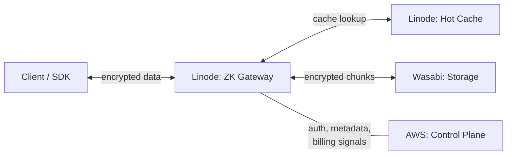
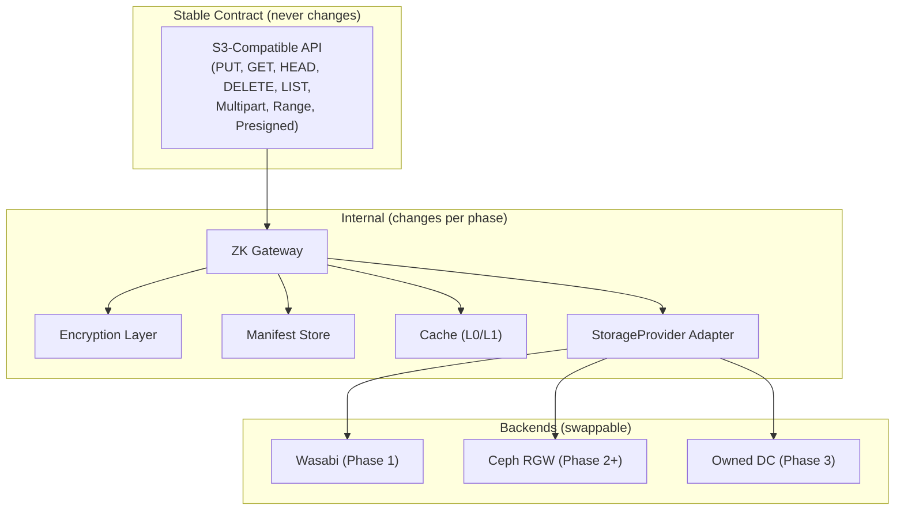
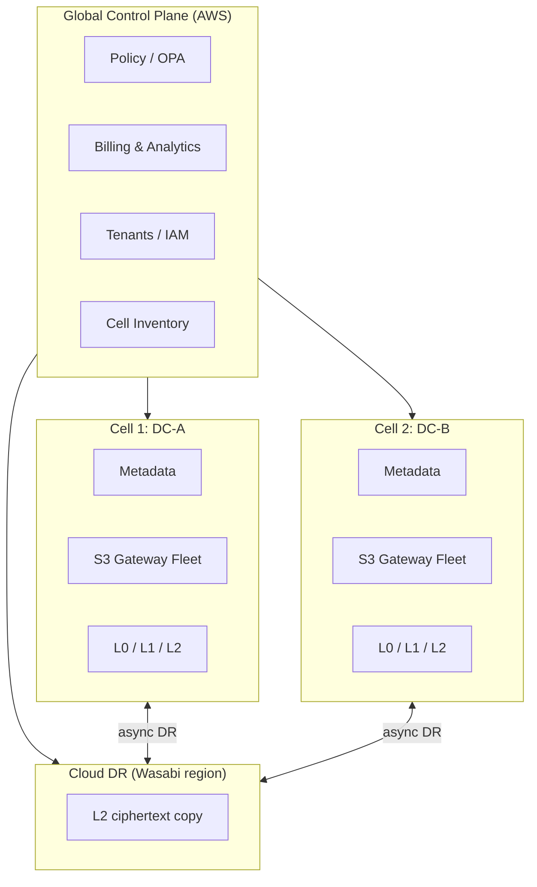

# ZK Object Fabric — Technical Proposal

**License**: Proprietary — All Rights Reserved. See [LICENSE](../LICENSE).

> Status: Phase 3 — Beta Cell (COMPLETE). Phase 3.5 — Intra-Tenant
> Deduplication (NOT STARTED). Phase 4 — Production & Scale (NOT
> STARTED). This document defines the target architecture, not the
> current implementation. See [PROGRESS.md](PROGRESS.md) for build status.

---

## 1. Executive Summary

- **What**: ZK Object Fabric is a multi-tenanted, portable, zero-knowledge
  object storage fabric. It exposes an S3-compatible API at the edge,
  encrypts data client-side (or gateway-side for managed mode), stores
  ciphertext across pluggable storage backends, and serves hot reads
  from a regional cache.
- **Why**: The market leaves a gap.
  - **Wasabi** is proprietary and centralized, has no zero-knowledge
    mode, and uses an opaque fair-use egress policy. It is the
    cheapest S3-compatible storage available and the right Phase 1
    primary backend, but it is not a finished product for ZK-sensitive
    customers.
  - **Storj** is open and ZK-friendly, but its 80/29 erasure coding is
    tuned for untrusted peers and is too expensive to run on controlled
    DCs. Its AGPLv3 license is incompatible with a proprietary product.
  - **Backblaze B2** and **Cloudflare R2** are centralized, not ZK, and
    do not offer customer-controlled placement.
  - **No existing product** combines *ZK by default + customer-
    controlled placement + cache-aware pricing + cloud-to-local
    migration*.
- **How**: S3-compatible API, client-side encryption (per-object DEKs,
  encrypted manifests, optional CMK), provider-neutral object
  manifests, pluggable storage backends (with **Wasabi as the Phase 1
  primary**), a hot cache layer, explicit per-tenant bandwidth
  accounting, and a built-in migration engine.
- **Phase 1 stack**: **AWS control plane + Linode data plane + Wasabi
  storage backend.** Customer data flows only through Linode; it
  never transits AWS.
- **For whom**:
  - **B2C**: app developers who want cheap, private, S3-compatible
    storage behind an SDK and API key.
  - **B2B**: enterprises and sovereign customers who need dedicated
    cells, country / DC / rack-level placement, committed bandwidth,
    and SLAs.
- **License**: Proprietary. AGPL-licensed bases are ruled out for
  production. Permissive / weak-copyleft bases (Ceph RGW LGPL-2.1,
  SeaweedFS Apache-2.0) are acceptable for Phase 2+ local DC storage.
- **Key strategic insight**: Use public cloud first to prove the
  product and the migration layer. Because data flows only through the
  Linode data plane — never through AWS — bandwidth costs stay
  predictable. Cost leadership is claimed only after moving to local
  DC cells in Phase 3.

### 1.1 Tech stack

- **Server-side: Go.** The ZK Gateway, control-plane services
  (metadata, auth, billing, placement policy evaluation, migration
  orchestration), and storage provider adapters are written in Go.
  Go is chosen for operational scalability, developer velocity, and
  ecosystem maturity (HTTP servers, S3 clients, Kubernetes operators,
  observability).
- **Frontend: React.** Tenant console, admin dashboards, self-service
  onboarding, billing portal, and operator UIs.
- **Rust, selectively.** Used only where it makes a large, measurable
  difference: chunking and encryption hot paths, cache eviction loops,
  erasure-coding workers (Phase 2+), and any node-local agent where
  memory footprint and per-byte CPU cost matter. Rust is **not** the
  default server-side language.

---

## 2. Market Analysis & Pricing

### 2.1 Competitive landscape

| Backend                       | Storage cost              | Egress model                                  | Strategic use                                                              |
| ----------------------------- | ------------------------- | --------------------------------------------- | -------------------------------------------------------------------------- |
| Wasabi                        | ~$6.99 / TB-mo            | Free, fair-use ≤ 1× stored                    | **Phase 1 primary storage backend.** Main price benchmark.                 |
| Akamai / Linode Object Storage| ~$20 / TB-mo              | 1 TB / mo included, overage ~$5 / TB          | Data plane compute, not primary storage                                    |
| AWS S3 Standard               | ~$23 / TB-mo              | Egress ~$0.09 / GB                            | Control plane only. **Never use for data path.**                           |
| Cloudflare R2                 | ~$15 / TB-mo              | No egress charge, request fees                | Alternative hot egress layer                                               |
| Backblaze B2                  | ~$6 / TB-mo               | Free egress up to 3× stored, then ~$0.01 / GB | Alternative storage backend                                                |
| Storj                         | ~$6–$15 / TB-mo by tier   | 1× free egress included                       | ZK and distributed-design **benchmark only** — not usable as prod base     |

### 2.2 Phase 1 economics with AWS + Linode + Wasabi

Why this stack works:

- **Wasabi at ~$6.99 / TB-mo** is the cheapest S3-compatible storage
  with included egress. It is the right place to put long-term
  ciphertext in Phase 1.
- **Linode** provides data-plane compute with predictable bandwidth.
  Each Linode instance includes a monthly transfer allowance that
  absorbs hot-read egress from the cache.
- **AWS control-plane costs are minimal** — a modest RDS, IAM,
  CloudWatch, and a small compute footprint — because **no customer
  data** crosses AWS.
- **Total Phase 1 COGS per TB** = Wasabi storage per TB-mo + amortized
  Linode compute / bandwidth per TB served + amortized AWS control-
  plane cost per tenant. This is significantly cheaper than putting
  the data path on AWS S3 or Akamai Object Storage.
- **Fair-use constraint**: Wasabi's included egress assumes monthly
  egress ≤ active storage volume. The data plane must respect this.
  The **Linode cache is the mechanism** — hot objects are pinned in
  Linode NVMe / block storage so repeat reads do not hit Wasabi.

### 2.3 Pricing conclusion

With Wasabi as the backend, Phase 1 retail pricing can be more
competitive than previously estimated. The privacy premium over
direct Wasabi is the value proposition: customers get ZK encryption,
placement policy, provider neutrality, and migration-readiness on top
of Wasabi-class storage economics. Storage cost and bandwidth cost
must still be separated in all pricing; "unlimited egress" is
disallowed.

### 2.4 Pricing by phase

#### Phase 1 — AWS + Linode + Wasabi

| Product               | Backend                     | Suggested retail          | Positioning                                              |
| --------------------- | --------------------------- | ------------------------- | -------------------------------------------------------- |
| ZK Beta               | Wasabi via Linode           | $9.99–$14.99 / TB-mo      | ZK + placement + portability premium over Wasabi direct  |
| ZK Hot                | Wasabi + Linode cache       | $14.99–$19.99 / TB-mo     | High egress, frequent reads, cache-served                |
| BYOC Control Plane    | Customer's own cloud        | SaaS fee + usage          | Enterprise, customer pays storage directly               |
| Migration Layer       | Cloud → local DC            | Project or usage fee      | Builds future local storage demand                       |

#### Phase 2 — Hybrid (local DC primary + Wasabi / cloud DR)

| Product                  | Backend                        | Suggested retail       |
| ------------------------ | ------------------------------ | ---------------------- |
| ZK Standard              | Local primary + Wasabi DR      | $6.99–$8.99 / TB-mo    |
| ZK Standard (Strict)     | Local EC + customer keys       | $7.99–$11.99 / TB-mo   |
| ZK Hot                   | Local cache + CDN              | $9.99–$19.99 / TB-mo   |
| Dedicated PB Cell        | Reserved local capacity        | Custom                 |

#### Phase 3 — Local DC

| Product         | Backend                                | Possible retail target |
| --------------- | -------------------------------------- | ---------------------- |
| ZK Archive      | Local HDD EC                           | $2.99–$4.99 / TB-mo    |
| ZK Standard     | Local HDD EC + limited egress          | $4.99–$6.99 / TB-mo    |
| ZK Hot          | Local EC + NVMe cache + replica        | $7.99–$12.99 / TB-mo   |
| ZK Sovereign    | Reserved racks or nodes                | Contracted             |

### 2.5 Key insight

Storage cost and bandwidth cost must be separated. Do **not** advertise
"unlimited egress." Wasabi's fair-use egress policy means **the Linode
cache layer is critical** — it absorbs repeated reads so Wasabi origin
egress stays within fair-use bounds. Cache hit ratio is a product
metric, not an implementation detail.

---

## 3. Architecture

### 3.1 Phase 1 Architecture: AWS + Linode + Wasabi

Phase 1 deliberately separates concerns across three providers so that
data never transits AWS, Linode is the only path for customer bytes,
and Wasabi is used purely as a durable-origin S3 endpoint.

#### AWS (Control Plane)

- Postgres / RDS for tenant, bucket, and object metadata (manifest
  headers, ACLs, versioning, tenant directory, policy store).
- IAM / auth token issuance (signed tokens consumed by the Linode
  gateway fleet).
- Billing counters and usage analytics (ClickHouse or an equivalent
  analytics store).
- Monitoring, alerting, operational dashboards (CloudWatch + derived
  pipelines).
- Placement policy engine (OPA / Rego or an equivalent evaluator).
- **No customer data** crosses AWS — only metadata, auth, billing, and
  control signals.

#### Linode (Data Plane)

- S3-compatible gateway fleet (receives every customer PUT / GET /
  HEAD / DELETE / LIST request).
- Hot object cache on NVMe or memory, in front of Wasabi.
- Encryption / decryption boundary for Managed Encrypted mode.
- Ciphertext streaming to and from Wasabi.
- Range GET handling (byte-range reads served from cache when
  possible).
- CDN integration point (Akamai or Cloudflare in front of the Linode
  gateway for globally distributed hot reads).
- **All customer data** flows through Linode only.

#### Wasabi (Storage Backend)

- Durable encrypted object / chunk storage.
- ~$6.99 / TB-mo with fair-use included egress.
- S3-compatible API — the Linode gateway speaks S3 to Wasabi.
- **90-day minimum storage duration applies.** The data plane must
  **not** use Wasabi for ephemeral objects. Short-TTL cache objects
  live on Linode, not Wasabi.

#### Data flow diagram



#### Design constraint

Data must **only** flow through the Linode data plane. The Linode-
hosted gateway handles:

1. Client authentication (validates tokens issued by the AWS control
   plane).
2. Encryption (client-side SDK validates, or the gateway encrypts
   directly in Managed Encrypted mode).
3. Chunking and manifest creation.
4. Writing encrypted chunks to Wasabi via the S3 API.
5. Reading encrypted chunks from Wasabi, or serving them from the
   Linode cache on hit.
6. Streaming ciphertext back to the client.

Metadata updates (manifest headers, billing counters, placement
decisions) are written to the AWS control plane over a dedicated
control channel. Those payloads contain **no customer data**, only
opaque object IDs, sizes, hashes, and accounting counters.

#### Wasabi fair-use management

Wasabi's free-egress policy assumes monthly egress ≤ stored data
volume. The Linode cache layer is essential. Hot objects are pinned
to Linode so repeated reads do not hit Wasabi origin. Promotion
policy (see §3.11) ensures frequently-read objects move to Linode
cache within a few reads.

### 3.2 S3 API Contract

The S3-compatible API is the **architectural invariant** of ZK Object
Fabric. It is the outermost layer of the system and the only surface
customers interact with. Everything below it — encryption, manifests,
cache, storage provider adapters, backends — can evolve, be replaced,
or be migrated between phases, but the S3 API must not change.

#### 3.2.1 Principle: S3 API is the phase-invariant contract

- The ZK Gateway exposes an S3-compatible API endpoint. This is the
  **only** interface customers interact with.
- The S3 API surface is **frozen across phases**. A client application
  that works against Phase 1 (Wasabi) MUST work identically against
  Phase 2+ (Ceph RGW) and Phase 3 (owned DC) without any code changes,
  SDK updates, endpoint changes, or credential rotation (beyond normal
  key rotation).
- The same bucket name, object key, URL path, and API semantics work
  in every phase. Backend migrations are invisible to the S3 API
  consumer.
- This is enforced by the `StorageProvider` adapter abstraction
  (§3.5) and the provider-neutral manifests (§3.3). The S3 API layer
  translates S3 operations into internal operations; the internal
  operations are dispatched to whichever backend currently holds the
  data.

We refer to this property as the S3 API being **phase-invariant** —
a constant across the variable of phase, backend, or deployment
model.

#### 3.2.2 Supported S3 operations (compatibility subset)

The following table defines the exact S3 operations supported. The
subset is deliberately tight: it covers the target use cases
(business files, chat uploads, file sharing, backup archives, media
distribution) and nothing else. It is better to support fewer
operations perfectly than many operations partially.

| Category     | Operation                                | Phase 1   | Phase 2+ | Phase 3 | Notes                                                                   |
| ------------ | ---------------------------------------- | --------- | -------- | ------- | ----------------------------------------------------------------------- |
| Object CRUD  | `PutObject`                              | Yes       | Yes      | Yes     | Gateway encrypts/chunks, writes to active backend                       |
| Object CRUD  | `GetObject`                              | Yes       | Yes      | Yes     | Gateway reads from cache or origin, decrypts if managed mode            |
| Object CRUD  | `HeadObject`                             | Yes       | Yes      | Yes     | Metadata from manifest; no origin read                                  |
| Object CRUD  | `DeleteObject`                           | Yes       | Yes      | Yes     | Manifest tombstone + async backend delete                               |
| Object CRUD  | `CopyObject`                             | Yes       | Yes      | Yes     | Server-side copy within same tenant                                     |
| Listing      | `ListObjectsV2`                          | Yes       | Yes      | Yes     | Served from metadata store, not backend                                 |
| Listing      | `ListBuckets`                            | Yes       | Yes      | Yes     | From tenant metadata                                                    |
| Multipart    | `CreateMultipartUpload`                  | Yes       | Yes      | Yes     | Gateway manages parts; assembles manifest on complete                   |
| Multipart    | `UploadPart`                             | Yes       | Yes      | Yes     | Each part encrypted/chunked independently                               |
| Multipart    | `CompleteMultipartUpload`                | Yes       | Yes      | Yes     | Assembles final manifest from part manifests                            |
| Multipart    | `AbortMultipartUpload`                   | Yes       | Yes      | Yes     | Cleans up part manifests and backend pieces                             |
| Range reads  | `GetObject` with `Range` header          | Yes       | Yes      | Yes     | Range-aligned encrypted chunks enable partial reads                     |
| Presigned    | Presigned GET/PUT URLs                   | Yes       | Yes      | Yes     | Gateway generates presigned URLs; URL format is phase-independent       |
| Bucket ops   | `CreateBucket`                           | Yes       | Yes      | Yes     | Creates namespace in metadata + backend bucket/prefix                   |
| Bucket ops   | `DeleteBucket`                           | Yes       | Yes      | Yes     | Requires empty bucket                                                   |
| Bucket ops   | `HeadBucket`                             | Yes       | Yes      | Yes     |                                                                         |
| Conditional  | `If-None-Match`, `If-Modified-Since`     | Yes       | Yes      | Yes     | Evaluated against manifest metadata                                     |
| Versioning   | `GetObject?versionId=`                   | Phase 1+  | Yes      | Yes     | Object versioning via manifest versions                                 |

**Operations explicitly NOT supported** (to avoid scope creep):

- S3 Select (SQL queries on objects)
- S3 Object Lambda
- S3 Batch Operations
- S3 Storage Lens
- S3 Inventory
- Bucket policies (replaced by ZK placement policies — see §3.10)
- Cross-region replication (replaced by the ZK migration engine — see §4)
- S3 Transfer Acceleration (replaced by the ZK cache layer — see §3.7)
- Object Lock / WORM (deferred to Phase 3)

#### 3.2.3 S3 API behavior across backend transitions

Each S3 operation must behave consistently during a backend migration
(for example, Wasabi → Ceph RGW). The client sees no difference at
any point.

- **During dual-write**: `PutObject` writes to both backends.
  `GetObject` reads from the primary (new backend) first, falls back
  to the old backend. The client sees no difference.
- **During lazy migration**: `GetObject` for an object still on the
  old backend triggers a transparent migration. The response is
  served normally; the migration happens in the background. Latency
  may be slightly higher for the first read of a not-yet-migrated
  object (origin read from old backend + write to new backend), but
  subsequent reads are served from the new backend or cache.
- **After migration**: all operations go to the new backend. The old
  backend copy is drained after the grace period. The client never
  knew a migration happened.
- **Presigned URLs**: presigned URLs generated before a migration
  remain valid because they point to the ZK Gateway endpoint, not to
  the backend directly. The gateway resolves the current backend from
  the manifest at request time.

#### 3.2.4 S3 API compliance test suite

The `tests/s3_compat/` directory contains an S3 compliance test suite
that:

- Runs the full supported operation set against every
  `StorageProvider` adapter (`wasabi`, `ceph_rgw`, `local_fs_dev`,
  etc.).
- Validates that the API behavior is **identical** regardless of
  which backend is active.
- Includes migration-in-progress tests: runs the suite while a
  backend migration is in progress and verifies zero behavioral
  differences.
- Uses the AWS SDK (Go and JS) as the test client to ensure
  real-world SDK compatibility.
- Runs in CI on every commit and before every phase transition.

The compliance test suite is the enforcement mechanism. Without it,
"S3 compatible" is a marketing claim; with it, it is an engineering
guarantee.

#### 3.2.5 S3 API as the stable surface



The S3 API sits at the top. Everything below it is internal and may
change per phase. Everything above it is the customer's application,
which does not change across phases.

### 3.3 Critical design decision: customer object ≠ provider object

Provider-neutral manifests are used from day one:

```
customer object  →  encrypted chunks  →  encrypted manifest  →  backend pieces  →  provider-specific locators
```

This indirection lets ZK Object Fabric move a bucket from Wasabi to a
local DC cell without changing the customer-facing bucket name,
object key, URL, or API. The manifest records which provider currently
holds each piece, and the migration engine rewrites those locators
without touching the customer's namespace.

This indirection is what makes the S3 API phase-invariant. The
customer interacts with the S3 API using bucket names and object
keys; the manifest maps those to backend-specific locators that
change during migration without affecting the S3 surface.

### 3.4 Object manifest format

```json
{
  "tenant_id": "tnt_123",
  "bucket": "prod-assets",
  "object_key_hash": "blake3:...",
  "version_id": "v7",
  "object_size": 10737418240,
  "chunk_size": 16777216,
  "encryption": {
    "mode": "client_side",
    "algorithm": "xchacha20-poly1305",
    "key_id": "customer-managed",
    "manifest_encrypted": true
  },
  "placement_policy": {
    "residency": ["SG"],
    "allowed_backends": ["wasabi-ap-southeast-1", "local-cell-1"],
    "min_failure_domains": 2,
    "hot_cache": true
  },
  "pieces": [
    {
      "piece_id": "p_001",
      "hash": "blake3:...",
      "backend": "wasabi-ap-southeast-1",
      "locator": "s3://zk-prod-a/pieces/p_001",
      "state": "active"
    }
  ],
  "migration_state": {
    "generation": 4,
    "primary_backend": "local-cell-1",
    "cloud_copy": "drain_after_30d"
  }
}
```

The manifest itself is encrypted before it is stored in the metadata
DB. The control plane sees only the manifest ID, size, and placement
tags required for policy evaluation.

### 3.5 Storage provider adapter

All backends implement the same `StorageProvider` interface:

```go
type StorageProvider interface {
    PutPiece(ctx context.Context, pieceID string, r io.Reader, opts PutOptions) (PutResult, error)
    GetPiece(ctx context.Context, pieceID string, r *ByteRange) (io.ReadCloser, error)
    HeadPiece(ctx context.Context, pieceID string) (PieceMetadata, error)
    DeletePiece(ctx context.Context, pieceID string) error
    ListPieces(ctx context.Context, prefix, cursor string) (ListResult, error)
    Capabilities() ProviderCapabilities
    CostModel() ProviderCostModel
    PlacementLabels() PlacementLabels
}
```

Planned implementations:

- `wasabi` — **Phase 1 primary backend.**
- `aws_s3` — DR / backup only. **Not used in the data plane.**
- `backblaze_b2` — alternative storage backend.
- `cloudflare_r2` — alternative hot egress layer.
- `local_fs_dev` — developer loopback for tests.
- `ceph_rgw` / `seaweedfs` — Phase 2+ local DC storage.

Adapters report cost models and placement labels back to the policy
engine so placement decisions can factor in per-provider $/GB, egress
policy, and regulatory tags.

Every adapter MUST pass the S3 compliance test suite
(`tests/s3_compat/`, §3.2.4). A new adapter is not considered
production-ready until it passes 100% of the compliance tests. This
ensures that swapping backends does not change S3 API behavior.

### 3.6 Control plane (on AWS)

Responsibilities:

- Tenant, bucket, object manifest metadata.
- Placement policy evaluation.
- Backend inventory and health.
- Billing counters (storage-seconds, PUTs, GETs, egress bytes).
- Abuse controls (rate limits, anomaly detection).
- Migration state and orchestration signals.

Technology choices:

- **Metadata store**: Postgres / RDS for Phase 1. Migrate to
  CockroachDB or FoundationDB if per-row transaction throughput on a
  single primary becomes the bottleneck.
- **Billing / analytics**: ClickHouse for high-cardinality event
  ingestion and cost / SLA reporting.
- **Policy engine**: OPA / Rego (or a Go-native evaluator) for
  placement rules, egress budgets, and tenant guardrails.

Example placement policy (YAML, evaluated by OPA):

```yaml
tenant: acme-fintech
bucket: acme-vault
policy:
  encryption:
    mode: zk                    # client-side only
    kms: customer-managed
  placement:
    country: ["DE", "AT"]
    provider: ["wasabi", "local-cell-1"]
    min_dcs: 2
    min_racks: 6
    node_class: ["hdd-dense"]
    disk_class: ["cmr-enterprise"]
    carbon_profile: ["low"]
    sovereignty_tag: "eu-only"
  erasure_coding:
    profile: "10+4"              # Phase 2+ only
    stripe_mb: 4
  egress:
    monthly_budget_tb: 50
    burst_gbps: 5
    serve_from: ["l0", "l1"]
```

The control plane handles **no customer data**. It sees only opaque
object IDs, sizes, hashes, and accounting counters.

### 3.7 Data plane — three layers

| Layer | Function                                | Storage format                                | Phase 1 implementation                                            |
| ----- | --------------------------------------- | --------------------------------------------- | ----------------------------------------------------------------- |
| L0    | Serve hot reads close to users          | Full encrypted object or range chunks         | Linode NVMe / memory cache                                        |
| L1    | Reduce repeated origin reads            | Full encrypted object, 1–2 replicas           | Linode block storage, or a second Wasabi region used as a mirror  |
| L2    | Long-term durability                    | Provider-native (Wasabi) in Phase 1; EC shards in Phase 2+ | Wasabi S3                                              |

In Phase 1, Wasabi provides L2 durability natively — Wasabi handles
its own replication. Erasure coding is **not** needed until Phase 2+
when using local DC storage. The Linode cache layer (L0 / L1) is the
mechanism that keeps Wasabi egress within fair-use and that serves
hot reads with low latency.

**Why EC alone does not solve read bandwidth**: erasure coding lowers
*storage* overhead (for example 1.33× for 6+2 or 1.4× for 10+4) but
does not lower *read* bandwidth; every GET still transfers the
object bytes. Hot reads must therefore be served from L0 / L1 where
the object is materialized, not reconstructed from shards.

All three layers (L0, L1, L2) are invisible to the S3 API consumer.
The client issues a `GetObject`; the gateway decides whether to serve
from L0 cache, L1 replica, or L2 origin. The response format,
headers, and semantics are identical regardless of which layer served
the data.

### 3.8 Encryption model

- **Strict ZK**: client SDK performs encryption. Plaintext keys never
  cross to the service. Per-object DEKs are wrapped by the tenant's
  root key (customer-held or CMK).
- **Managed Encrypted** ("confidential managed storage"): the Linode
  gateway performs encryption. The gateway can see plaintext in
  memory during request handling. This mode is *not* zero-knowledge
  and must not be sold as such.
- **Public Distribution**: objects are stored encrypted at rest but
  served unencrypted at the edge for assets / media / downloads. The
  origin remains encrypted; distribution is explicitly public.

Per-object DEKs, encrypted manifests, and CMK support apply to all ZK
and confidential modes. **No cross-tenant deduplication** is ever
enabled — it is permanently incompatible with the zero-knowledge model.

**Intra-tenant deduplication** is supported via three integration
patterns documented in [INTEGRATION.md](INTEGRATION.md):

- **Pattern A** (single upload, N readers): no dedup logic needed.
  One PUT, N GETs. Works with all encryption modes.
- **Pattern B** (gateway convergent): for `managed` and
  `public_distribution` modes. The gateway derives a convergent DEK
  from `BLAKE3(plaintext)` so identical content within the same
  tenant produces identical ciphertext. Transparent to S3 clients.
- **Pattern C** (client-side convergent): for `client_side` (Strict
  ZK) mode. The client SDK derives the DEK and nonces from content
  so identical plaintext produces identical ciphertext. The gateway
  deduplicates on `BLAKE3(ciphertext)` without seeing plaintext.
  Trade-off: stored file loses forward secrecy.

Supported scenarios: B2C community (viral files, shared media within
a tenant) and B2B org (company-wide documents within an enterprise
tenant).

Encryption is transparent to the S3 API. In Strict ZK mode, the SDK
encrypts before calling `PutObject` and decrypts after `GetObject` —
the S3 API carries ciphertext. In Managed Encrypted mode, the
gateway encrypts/decrypts transparently — the S3 API carries
plaintext. In both cases, the S3 API semantics (status codes,
headers, ETags) are identical.

### 3.9 Erasure coding model (Phase 2+ only)

| Environment                              | Recommended EC   | Raw overhead  | Use case                                             |
| ---------------------------------------- | ---------------- | ------------- | ---------------------------------------------------- |
| Hot local                                | 2 replicas or 4+2 EC | 2.0× or 1.5× | Low latency, high read rate                         |
| Standard local (single DC)               | 6+2              | 1.33×         | Hot regional objects with fast repair                |
| Standard local (2–3 DCs)                 | 8+3              | 1.375×        | Good default                                         |
| Large durable local                      | 10+4             | 1.4×          | PB-scale storage                                     |
| Archive                                  | 12+4 or 16+4     | 1.33×–1.25×   | Cold data with slower repair                         |

During Phase 1, Wasabi handles durability natively and EC is not
needed. Do not overbuild EC.

### 3.10 Placement control

- **Phase 1**: expose `provider`, `region`, `country`, `storage_class`.
  Example:

  ```yaml
  placement:
    country: SG
    provider: wasabi
    region: ap-southeast-1
    storage_class: standard
    cache_location: linode-sg
  ```

- **Phase 2+**: expose DC / rack / node / disk via a CRUSH-like
  topology (see §6).

Do **not** expose node-level placement in Phase 1. Provider and region
are the only meaningful knobs while Wasabi owns durability.

### 3.11 Read path & promotion

#### Phase 1 read path

```
GET object
  → Linode ZK Gateway
  → Linode hot cache lookup
  → if miss: read encrypted chunks from Wasabi
  → stream ciphertext to client
  → client decrypts (Strict ZK) or gateway decrypts (Managed mode)
  → if read frequency crosses threshold: promote to Linode cache
```

#### Phase 2+ read path

```
GET object
  → nearest ZK Gateway
  → check local cache
  → check local DC primary
  → if missing: read from Wasabi (cloud fallback)
  → verify hash
  → write local copy
  → update manifest
  → serve object
```

#### Promotion trigger rules

- `monthly_egress(obj) ≥ 0.2 × object_size`
- `daily_read_count(obj) > N` (tier-configurable)
- `p95 latency miss > SLO`
- Tenant is on the Hot tier (default-aggressive promotion)

**Critical for Phase 1**: promotion to Linode cache keeps Wasabi
egress within fair-use. If a hot object is read repeatedly, it **must**
be cached on Linode to avoid excessive Wasabi origin reads.

### 3.12 Bandwidth strategy

- **Phase 1**: Linode provides the bandwidth. Wasabi fair-use egress
  is the constraint. A cache-first design on Linode absorbs hot reads.
- **Phase 3**: flat / high-commit bandwidth providers (Leaseweb,
  FDCServers, OVH) for local DC cells.

Rules:

- Never read from Wasabi repeatedly for hot objects — promote to
  Linode cache.
- Cache ciphertext, not plaintext.
- Use range-aligned encrypted chunks so range GETs can be served from
  cache without reconstruction.
- Charge separately for non-cacheable egress (large single-read
  transfers, public downloads without a CDN).

### 3.13 Lightweight container deployment (dev / demo)

The gateway is packaged as a single Docker container for local
development, integration testing, and demo environments. This is the
recommended way for downstream services (zk-drive, kmail, or any
S3-consuming application) to run a local ZK Object Fabric backend.

#### What the container includes

- **Go gateway binary** — built from `cmd/gateway/main.go` with all
  provider adapters compiled in.
- **React console frontend** — Vite production build served by the
  console API on `:8081`.
- **Demo config** (`demo/config.json`) — `local_fs_dev` backend with
  root at `/data/objects`, in-memory manifest store, logger billing
  sink, cache at `/data/cache`.
- **Demo tenant** (`demo/tenants.json`) — a pre-loaded tenant with
  HMAC credentials so S3 clients can authenticate immediately.

#### What the container does NOT include

- No Postgres, ClickHouse, or any external database.
- No cloud provider credentials (Wasabi, B2, R2, Storj, AWS).
- No TLS termination (intended to sit behind a reverse proxy or be
  used on `localhost`).

#### Networking

| Port    | Service                |
| ------- | ---------------------- |
| `:8080` | S3-compatible data API |
| `:8081` | Console / admin API    |

Downstream services running in the same Docker Compose network
address the gateway as `http://zk-fabric:8080`. External clients
use `http://localhost:8080`.

#### Data persistence

Object bytes written to `local_fs_dev` persist in the `zk-data`
Docker volume across container restarts. Tenant records, manifests,
and billing counters are in-memory and reset on restart. This is
acceptable for dev / demo; production deployments use Postgres-backed
stores and the ClickHouse billing sink.

#### Relationship to production deployment

The container runs the **same gateway binary** as production. The
only differences are the config file (which selects `local_fs_dev`
instead of `wasabi` / `ceph_rgw`) and the store backends (in-memory
instead of Postgres). Switching from the demo container to a
production deployment is a config change, not a code change.

### 3.14 Intra-tenant deduplication

#### 3.14.1 Design principle

Deduplication operates **exclusively within a single tenant's
namespace**. Cross-tenant deduplication is permanently excluded from
the fabric: it would let one tenant probe for content held by
another, defeating the zero-knowledge guarantee. Two product
scenarios drive intra-tenant dedup:

- **B2C community**: viral files and shared media inside a single
  consumer-tenant (e.g. a meme reposted N times in a KChat
  community lands as one stored object).
- **B2B org**: a company-wide document (handbook, policy PDF,
  onboarding deck) referenced by many users inside one enterprise
  tenant lands as one stored object.

#### 3.14.2 Three integration patterns

| Pattern | Encryption mode                       | Who computes content hash       | Dedup mechanism                 | Client changes needed                       |
| ------- | ------------------------------------- | ------------------------------- | ------------------------------- | ------------------------------------------- |
| A       | any mode                              | N/A                             | none — single upload, N readers | none                                        |
| B       | `managed`, `public_distribution`      | gateway: `BLAKE3(plaintext)`    | ContentIndex on plaintext hash  | none                                        |
| C       | `client_side` (convergent variant)    | client SDK: `BLAKE3(plaintext)` | ContentIndex on ciphertext hash | `ConvergentNonce` + `DeriveConvergentDEK`   |

Pattern A is application-level reuse: one tenant uploads once, the
application's permission system grants N readers access to the same
object. The fabric is unchanged.

Patterns B and C are storage-level dedup: the second PUT of the same
content hash within the same tenant resolves to the existing piece
and only increments a refcount. They differ only in **who** computes
the content hash and **what** is hashed (plaintext vs. ciphertext),
which falls out of the encryption mode.

#### 3.14.3 Object-level dedup (all backends)

**Pattern B — gateway convergent (managed / public_distribution):**

1. Client `PUT` carries plaintext.
2. Gateway streams plaintext through BLAKE3 and computes
   `content_hash = BLAKE3(plaintext)`.
3. Gateway looks up `(tenant_id, content_hash)` in `content_index`.
4. **Hit**: gateway increments `ref_count`, writes a manifest that
   points at the existing `piece_id`, and returns a synthetic
   `ETag` matching the deduped object. No backend write.
5. **Miss**: gateway derives `DEK = HKDF(content_hash, salt=tenant_id)`,
   encrypts with XChaCha20-Poly1305, writes the piece to the
   provider, and `INSERT`s the `content_index` row.

**Pattern C — client-side convergent (Strict ZK):**

1. Client SDK streams plaintext through BLAKE3 and computes
   `content_hash = BLAKE3(plaintext)`.
2. SDK derives `DEK = HKDF(content_hash, salt=tenant_id)` and
   uses content-derived nonces (`ConvergentNonce: true`) so
   identical plaintext produces identical ciphertext.
3. SDK uploads ciphertext. Gateway hashes ciphertext on the wire
   and computes `content_hash_cipher = BLAKE3(ciphertext)`.
4. Gateway looks up `(tenant_id, content_hash_cipher)` in
   `content_index`. Hit → refcount++, manifest reuse. Miss →
   write piece, insert row.

In both patterns the gateway never sees cross-tenant content: the
`content_index` primary key is `(tenant_id, content_hash)`.

ContentIndex schema:

```sql
CREATE TABLE content_index (
    tenant_id     TEXT        NOT NULL,
    content_hash  TEXT        NOT NULL,
    piece_id      TEXT        NOT NULL,
    backend       TEXT        NOT NULL,
    ref_count     INT         NOT NULL DEFAULT 1,
    size_bytes    BIGINT      NOT NULL DEFAULT 0,
    created_at    TIMESTAMPTZ NOT NULL DEFAULT now(),
    PRIMARY KEY (tenant_id, content_hash)
);

CREATE INDEX content_index_piece_id ON content_index (piece_id);
```

The `piece_id` index supports orphan GC and reverse lookups when the
provider reports a missing piece.

#### 3.14.4 Block-level dedup (Ceph RGW only)

Object-level dedup catches whole-file duplicates. For partial overlap
(two near-identical PDFs, two builds of the same archive, large
documents that share boilerplate), Ceph offers **native dedup at the
RADOS layer** via its dedup pool tier with content-defined chunking.

This runs entirely beneath the gateway: the gateway PUTs encrypted
pieces to Ceph as usual, and Ceph identifies duplicate variable-sized
chunks across the tenant's pool and stores them once. The gateway
does not implement chunk-level dedup logic itself.

Block-level dedup is **dedicated B2B cells only**. It requires Ceph
RGW, so it does not apply to Wasabi / B2 / R2 backends, and it
requires per-tenant pool isolation so chunk pools cannot cross
tenants. B2C community traffic on shared cells uses object-level
dedup only.

#### 3.14.5 Reference-counted deletes

`DELETE` on a deduplicated object follows a refcount-decrement path:

1. Gateway resolves the manifest and finds `(tenant_id,
   content_hash)`.
2. `UPDATE content_index SET ref_count = ref_count - 1 WHERE
   tenant_id = $1 AND content_hash = $2 RETURNING ref_count`.
3. If `ref_count > 0`: only the manifest is deleted; the piece
   stays.
4. If `ref_count = 0`: gateway calls `provider.DeletePiece` to
   remove the ciphertext from the backend, then `DELETE`s the
   `content_index` row.

A background **orphan GC** worker handles crash recovery: it scans
`content_index` rows whose `piece_id` no longer corresponds to any
manifest within the tenant and reclaims them. This bounds the damage
window of a crash between the manifest delete and the refcount
decrement.

#### 3.14.6 Encryption constraints

| Encryption mode                       | Dedup pattern | Notes                                                         |
| ------------------------------------- | ------------- | ------------------------------------------------------------- |
| `managed`                             | B             | gateway derives DEK from plaintext hash                       |
| `public_distribution`                 | B             | gateway derives DEK from plaintext hash                       |
| `client_side` (convergent variant)    | C             | client SDK derives DEK; opt-in per bucket / per object        |
| `client_side` (random DEK — default)  | none          | random per-object DEK ⇒ ciphertext never matches; FS retained |

Convergent encryption is an **explicit opt-in** at the bucket or
object level. The default Strict ZK mode keeps random DEKs and full
forward secrecy on stored files; Pattern C is enabled only when the
tenant accepts the FS trade-off in exchange for dedup.

#### 3.14.7 MLS compatibility

KChat / KMail group messaging uses MLS (RFC 9420). MLS provides two
distinct properties:

- **Forward Secrecy (FS) of the message channel**: a compromised
  current key cannot decrypt past messages. Driven by epoch ratchet.
- **Post-Compromise Security (PCS)**: a future epoch heals from a
  current compromise. Driven by member key rotation.

These are properties of the **message channel** and are fully
preserved regardless of which dedup pattern is used for the
underlying file blob: dedup happens at the storage layer, after
the application has already encrypted the message envelope.

The constraint is that the **file CEK must be independent of MLS
epoch secrets**. Concretely: do **NOT** derive the file CEK from
`exporter_secret` (it is bound to the current MLS epoch and rotates
on every group membership change, which would break dedup as soon
as a member joins or leaves). Acceptable derivations:

- Pattern A / B: random per-object DEK in the gateway (default), or
  `HKDF(content_hash, salt=tenant_id)` for Pattern B convergence.
- Pattern C: `HKDF(content_hash, salt=tenant_id)` in the client SDK.

The **stored file's** forward-secrecy depends on the CEK scheme:

- Random DEK → file FS preserved (no two PUTs of the same content
  produce the same DEK).
- Convergent DEK → file FS lost (the DEK is recoverable from the
  content, so a future plaintext leak retroactively reveals the
  ciphertext key).

This is an explicit, documented trade-off scoped to the stored file
only — it does not affect MLS message-channel FS or PCS. See
[INTEGRATION.md](INTEGRATION.md) for application-side guidance.

#### 3.14.8 Non-MLS applications

Applications that do not use MLS (`kmail` standard mode, `zk-drive`,
`Kapp`, vanilla S3 clients) integrate as follows:

- **Pattern A**: the application shares object keys through its own
  permission system (e.g. `zk-drive` shares a `FileVersion` row).
  No fabric changes; works with every encryption mode.
- **Pattern B**: no client changes. The S3 PUT is unchanged; the
  gateway computes BLAKE3 on the plaintext and dedupes
  transparently. Works with any S3 SDK in any language.
- **Pattern C**: requires content-derived DEK + nonces.
  - **Go**: use the bundled `client_sdk` with
    `Options{ConvergentNonce: true}` and
    `DeriveConvergentDEK(contentHash, tenantID)`.
  - **Other languages**: implement BLAKE3 + HKDF-SHA256 against the
    documented derivation (`DEK = HKDF(BLAKE3(plaintext),
    salt=tenant_id, info="zkof-cdek-v1", L=32)`) and a deterministic
    nonce scheme (`nonce_i = HKDF(DEK, info="zkof-nonce-v1" ||
    chunk_index, L=24)`).

#### 3.14.9 Fallback / DR copies

Disaster-recovery copies on the secondary backend are **always full,
non-deduped objects**. DR is for survivability, not cost: paying for
a duplicate full copy of a deduped object is the price of being able
to fail over without recomputing the dedup graph.

| Tenant tier | Primary (deduped)        | DR copy (always full, non-deduped)    |
| ----------- | ------------------------ | ------------------------------------- |
| B2C         | Wasabi or shared Ceph    | Backblaze B2 or Cloudflare R2         |
| B2B         | dedicated Ceph cell      | second dedicated Ceph cell            |

`MigrationState.CloudCopy` on the manifest tracks the DR backend the
full copy was written to. Reading from the DR copy fans out a
side-effect-free GET against the secondary backend; promotion back
to primary uses the existing migration engine and re-enters the
dedup index on the way in.

#### 3.14.10 What does NOT dedup

By design, the following do not deduplicate against each other:

- **Cross-tenant content**: `content_index` is keyed on
  `(tenant_id, content_hash)`. Two tenants holding identical bytes
  store two physical copies. This is permanent.
- **`client_side` with random DEK**: the default Strict ZK mode
  produces a fresh random DEK per object so ciphertext for the
  same plaintext differs every PUT. The gateway has no way to
  detect identity and writes a new piece each time.
- **Different encryption modes on the same content**: a `managed`
  PUT and a `client_side` (convergent) PUT of the same plaintext
  derive DEKs through different rules and produce different
  ciphertext, so they appear under different `content_hash` values
  and are stored separately.

These are not bugs — each follows from the encryption-mode
guarantee that mode promises the tenant.

---

## 4. Migration Design

### 4.1 Why migration is a first-class feature

Customers must be able to start on Wasabi via Linode and end up on a
local DC cell without changing their SDK, bucket name, URL, or object
key. Customer namespaces are decoupled from backend locators (see
§3.3), so migration is a manifest-rewrite, not a client-visible event.

The S3 API is the contract. Migration is invisible to the S3 API
consumer. The same `aws s3 cp`, `boto3`, or `@aws-sdk/client-s3`
command works before, during, and after a migration. No endpoint
change, no credential rotation, no SDK update, no bucket rename.

### 4.2 Phase 1 → Phase 2 migration

Move objects from **Wasabi → local DC cell** using three mechanisms:

1. **Dual-write for new objects**: once a tenant is flagged for
   migration, new PUTs go to both the local cell and Wasabi until the
   local cell is confirmed durable.
2. **Lazy migration on read**: on a GET, if the object is not yet on
   the local cell, read from Wasabi, verify the hash, write a local
   copy, update the manifest, serve the response.
3. **Background rebalancer**: a worker drains cold objects from
   Wasabi to the local cell over committed bandwidth, in priority
   order.

### 4.3 Migration state machine

```
wasabi_primary
  ↓
dual_write
  ↓
local_primary_wasabi_backup
  ↓
local_primary_wasabi_drain
  ↓
local_only
```

Each state is recorded on the manifest at `migration_state.generation`.
Readers use the generation to choose where to look first.

### 4.4 Read behaviour during migration

```
GET object
  → check local cell
  → if missing: read from Wasabi
  → verify hash (BLAKE3)
  → write local copy (async if tenant SLA allows)
  → update manifest
  → serve object
```

Hot objects self-migrate first via lazy read migration; cold objects
are handled by the background rebalancer.

### 4.5 Required capabilities

| Capability                      | Why                                                                             |
| ------------------------------- | ------------------------------------------------------------------------------- |
| Dual-write                      | Ensures durability during cut-over                                              |
| Lazy migration on read          | Hot objects move first, on user-paid bandwidth                                  |
| Background rebalancer           | Drains cold tail without hot-path penalty                                       |
| Manifest versioning             | Readers can roll back during a bad cut-over                                     |
| Cryptographic verification      | BLAKE3 hash check on every piece after move                                     |
| Backend drain state             | Wasabi retains a copy for a configurable grace period before delete             |
| Placement simulator             | Predicts cost and risk of a migration before it is executed                     |

---

## 5. Multi-Tenancy Design

### 5.1 Per-tenant isolation

- **Encryption keys**: independent per tenant. CMK supported. No shared
  DEKs across tenants.
- **Placement policies**: bound to tenant (and optionally to bucket).
- **Egress budgets**: hard + soft caps, burst limits, monthly budgets.
- **Billing counters**: separate storage-seconds, request, and byte
  counters per tenant and per bucket.
- **Abuse controls**: rate limits, anomaly detection, throttling,
  reputation, and optional CDN shielding.

### 5.2 B2C model

- Shared ("pooled") gateways and cache.
- Self-service API keys and SDKs.
- SDK handles client-side encryption; plaintext keys never cross to
  the service.
- Automated onboarding: signup → bucket → API key in minutes.
- Standard tier defaults (ZK Beta or ZK Hot in Phase 1; ZK Standard or
  ZK Hot in Phase 2+).

### 5.3 B2B model

- Dedicated cells (physical or logical) in Phase 2+.
- Custom SLAs (durability, availability, latency).
- Sovereign placement (specific countries / DCs / racks).
- Committed bandwidth contracts.
- Custom EC profile per cell.

### 5.4 BYOC (Bring Your Own Cloud)

- Customer owns the AWS / GCP / Azure account and pays the cloud bills
  directly.
- ZK Object Fabric ships the gateway, SDK, migration engine, and
  control-plane tooling as SaaS.
- Useful for early enterprise adoption before local DC cells are in
  place.

### 5.5 Tenant metadata schema (conceptual)

```yaml
tenant:
  id: t_01H....
  name: acme-fintech
  contract_type: b2b_dedicated     # b2c_pooled | b2b_dedicated | sovereign | byoc
  license_tier: standard           # beta | archive | standard | hot | dedicated | sovereign
  keys:
    root_key_ref: cmk://acme/prod/root
    dek_policy: per_object
  placement_default:
    policy_ref: p_country_strict
  budgets:
    egress_tb_month: 50
    requests_per_sec: 5000
  abuse:
    anomaly_profile: finance
    cdn_shielding: enabled
  billing:
    currency: USD
    invoice_group: acme-corp
```

---

## 6. Cell Architecture (Phase 2+)

### 6.1 Why not one giant cluster

- **Blast radius**: a bug, a repair storm, or an abuse event must not
  affect every tenant globally.
- **Repair complexity**: repair traffic scales badly when one cluster
  spans many regions.
- **Policy scoping**: sovereign tenants need hard boundaries, not
  "mostly in-country" soft placement.
- **Billing and ops**: per-cell accounting simplifies cost allocation
  and capacity forecasting.

### 6.2 Cell sizing

A cell is **2–20 PB usable**. Below 2 PB the per-cell overhead
dominates; above 20 PB repair and failure domains get unwieldy.

### 6.3 Per-cell components

- Independent metadata shard (Postgres region / CockroachDB region /
  FoundationDB cluster).
- Repair queues scoped to the cell.
- Failure-domain topology pinned to the cell's DCs / racks / nodes.
- S3 gateway fleet sized to the cell's request volume. Every cell's
  gateway fleet exposes the same S3 API (§3.2); a client routed to
  Cell 1 or Cell 2 sees identical S3 behavior.
- Billing counters rolled up to the global control plane.
- Placement inventory (nodes, capacities, classes).

### 6.4 Cross-cell replication

Cross-cell replication is **policy-driven, not automatic**. Tenants
opt in when they need multi-region durability or latency. The default
is single-cell placement.

### 6.5 Global control plane with regional cells



---

## 7. In-Country Migration Path (Generic)

The first in-country target is **[target country]**. Concrete country
selection is a business decision and is left unspecified in this
document.

### 7.1 Minimum viable local design

- **Cell 1**: City A DC.
- **Cell 2**: City B DC.
- **Cloud DR**: nearest AWS or Wasabi region (async ciphertext copy).

### 7.2 Better design

- Add **Cell 3**: a second City A DC or a City C DC. This gives three
  independent failure domains in-country and satisfies stricter
  sovereign-storage requirements.

### 7.3 Explicit durability caveat

Do **not** claim strong in-country durability with one DC. A single
local DC plus cloud DR is a **transitional hybrid**, not sovereign
multi-site storage. Multi-site sovereign durability requires two or
more in-country cells.

### 7.4 Private-transit option

Where available, **AWS Direct Connect** or equivalent private-transit
links (MPLS, dedicated fibre) can be used for the control-plane
channel and for migration traffic between AWS and the local cells.
Private transit reduces public-internet exposure for control signals
and speeds up bulk migration. Customer data still flows through the
Linode data plane, not AWS.

---

## 8. Public Cloud Provider Selection

Phase 1 recommended stack:

| Component               | Choice                                     | Reason                                                               |
| ----------------------- | ------------------------------------------ | -------------------------------------------------------------------- |
| Control plane           | AWS (RDS, IAM, CloudWatch)                 | Enterprise trust; no data path needed                                |
| Data plane / gateway    | Linode compute instances                   | Predictable bandwidth; good compute pricing                          |
| Storage backend         | Wasabi                                     | ~$6.99 / TB-mo; cheapest S3-compatible; included egress              |
| Hot cache               | Linode NVMe / block storage                | Absorbs hot reads; keeps Wasabi egress in fair-use                   |
| CDN (optional)          | Cloudflare or Akamai                       | Additional edge caching for global distribution                      |
| DR copy                 | AWS S3 Standard-IA or a 2nd Wasabi region  | Not hot serving; cold DR only                                        |
| Encryption              | Client-side SDK or Linode-hosted gateway   | Required for real ZK                                                 |

Phase 2+ adds local DC cells (Ceph RGW or SeaweedFS on owned
high-density HDD storage) and migrates tenants off Wasabi on a
per-bucket basis.

---

## 9. Open-Source Base Assessment

ZK Object Fabric uses a **proprietary license**. Statically or
dynamically linking proprietary service code with AGPL code would
force the combined work under AGPL terms. Reference / study use is
fine; production build on AGPL is not.

### 9.1 Phase 1 base

- **Custom Go gateway + provider adapters.** Wasabi, B2, R2, S3, and a
  `local_fs_dev` adapter for tests. No Ceph or Storj fork.
- Rust is reserved for chunking / encryption / EC workers.

### 9.2 Phase 2+ base (local DC storage)

| Base       | License     | Maturity       | EC support              | Fit as a local-DC base            | Notes                                                                     |
| ---------- | ----------- | -------------- | ----------------------- | --------------------------------- | ------------------------------------------------------------------------- |
| Ceph RGW   | LGPL-2.1    | Very mature    | Yes (built-in)          | **Best durable-origin base**      | Production-grade at EB scale. Operationally heavy but well understood.    |
| SeaweedFS  | Apache-2.0  | Mature enough  | Yes                     | **Best fast-build base**          | Fast to iterate on. Permissive license. Active community.                 |
| Storj      | AGPLv3      | Mature         | Yes (80/29 default)     | Ruled out (license)               | Excellent ZK / EC reference. Cannot ship as a production base.            |
| MinIO      | AGPLv3      | Mature         | Yes                     | Avoid                             | AGPL + maintenance concerns. Not a viable base.                           |
| Garage     | AGPL-3.0    | Lightweight    | No (replication only)   | Small sovereign only              | No EC; unfit for PB-scale durability.                                     |
| Tahoe-LAFS | GPL / TGPPL | Stable, niche  | Yes (erasure in design) | Reference                         | Good ZK architecture reference; not a modern S3 base.                     |
| RustFS     | Apache-2.0  | Early          | In progress             | Watch                             | Permissive license; not yet production-ready. Revisit later.              |

> **Explicitly**: AGPL-licensed projects (Storj, MinIO, Garage) are
> ruled out as production bases because ZK Object Fabric ships under a
> proprietary license.

### 9.3 Recommended build paths

- **Option A — Fastest**: SeaweedFS (Apache-2.0) in Phase 2+ with the
  ZK Gateway, placement, repair, billing, and cache layers on top.
- **Option B — Most production-grade**: Ceph RGW (LGPL-2.1) in
  Phase 2+ with the ZK Gateway, placement abstraction, cache layer,
  and policy API on top.
- **Option C — Research / fork**: Storj — **RULED OUT** as a
  production base. Retained as a reference implementation for ZK-style
  EC and peer coordination.

---

## 10. What NOT to Do

| Bad move                                                           | Why                                                                                            |
| ------------------------------------------------------------------ | ---------------------------------------------------------------------------------------------- |
| Route customer data through AWS                                    | AWS egress costs destroy the economics. Data must stay on the Linode path.                     |
| Promise cheaper-than-Wasabi pricing during Phase 1                 | ZK Object Fabric adds margin on top of Wasabi. Claim cost leadership only in Phase 3.          |
| Ignore Wasabi's 90-day minimum storage duration                    | Ephemeral objects on Wasabi incur unnecessary minimum-storage charges. Keep short-TTL on Linode cache. |
| Exceed Wasabi's fair-use egress                                    | Triggers throttling or account review. Cache hit ratio is a first-class product metric.        |
| Advertise "unlimited egress"                                       | Forces cross-subsidization that breaks at PB+ scale; invites adverse-selection workloads.      |
| Reconstruct EC shards on every hot GET                             | EC lowers storage overhead, not read bandwidth. Hot reads must come from L0 / L1.              |
| Enable cross-tenant deduplication                                  | Permanently incompatible with ZK. Intra-tenant dedup only, via convergent encryption (§3.14). Cross-tenant dedup is never offered. |
| Use AGPL bases (Storj, MinIO, Garage) as production bases          | Conflicts with the proprietary license. Permitted only as reference / study material.          |
| Build Storj-style 80/29 EC in controlled DCs                       | Tuned for untrusted peers. Wastes capacity when nodes are controlled (use 8+3 or 10+4).        |
| Expose node-level placement in Phase 1                             | Meaningless while Wasabi owns durability. Wait until Phase 2+ for DC / rack / node knobs.      |
| Build a full decentralized reputation / token / satellite system   | Out of scope. Adds complexity without improving the Phase 1 / 2 value proposition.             |
| Publish theoretical "eleven nines" durability                      | Cannot be validated in Phase 1. Only publish measured durability from chaos tests.             |
| Block on a custom distributed filesystem                           | Wasabi is the Phase 1 durable origin; Ceph RGW or SeaweedFS is the Phase 2+ base.              |

---

## 11. Cost Architecture

### 11.1 Phase 1 COGS per usable TB

```
cost_per_TB_month_phase1 =
    wasabi_storage_per_TB_month                                  (~$6.99)
  + linode_compute_amortized_per_TB_served_per_month
  + linode_bandwidth_amortized_per_TB_served_per_month
  + aws_control_plane_amortized_per_tenant_per_month
  + ops_amortized_per_TB_per_month
```

Notes:

- Wasabi dominates the storage-at-rest line; cache in Linode NVMe is
  a small fraction of stored bytes.
- Linode bandwidth is pooled across instances; hot objects should be
  served from the included transfer allowance.
- AWS control-plane cost is roughly fixed per tenant, not per TB.

### 11.2 Phase 3 COGS per usable TB

```
cost_per_TB_month_phase3 =
    raw_disk_cost_per_TB_month × erasure_overhead
  + server_amortization_per_TB_month
  + rack_per_TB_month
  + power_per_TB_month
  + cooling_per_TB_month
  + operations_per_TB_month
  + repair_bandwidth_per_TB_month
  + metadata_cost_per_TB_month
```

- `erasure_overhead` is 1.33× (6+2), 1.375× (8+3), or 1.4× (10+4).
- Repair bandwidth is the dominant non-disk line item at PB+ scale and
  must be budgeted, not assumed free.
- Metadata cost scales with object count, not byte count.

### 11.3 Scale economics

| Scale    | Reality                                            | Implication                                              |
| -------- | -------------------------------------------------- | -------------------------------------------------------- |
| 1 TB     | Pooled / automated infrastructure                  | Must be self-service; no manual support                  |
| 100 TB   | Ops-sensitive; a few customers move the margin     | Per-tenant monitoring, egress budgets, support tier      |
| 1 PB     | Dedicated local nodes become viable                | Start moving large tenants off Wasabi-backed pools       |
| 10 PB+   | Owned HDD-dense nodes can undercut Wasabi per TB   | Win on price when bandwidth is committed                 |
| 1 EB+    | Cell architecture is mandatory                     | Multi-cell, cross-cell replication, repair federation    |

---

## 12. Competitive Positioning

### 12.1 At 1 TB (entry)

- Pooled Linode gateway + Wasabi backend.
- 1 TB minimum.
- Strict egress rules.
- Self-service signup through a React console.
- Automated abuse controls.
- Entry offer: ZK Beta on Wasabi via Linode.

### 12.2 At 100 TB – 10 PB (best zone)

This is the product's strongest zone. Win on:

- Erasure coding on controlled nodes (8+3 / 10+4, not 80/29) in
  Phase 2+.
- Dedicated cells or pooled-with-pinning.
- Regional cache layers.
- Committed bandwidth.
- Placement control (country / DC / rack).

### 12.3 At multi-million TB

Becomes an **infrastructure company problem**. Needs:

- Multi-cell architecture.
- Hardware procurement pipeline.
- DC, power, and cooling strategy.
- Global peering and transit.
- Automated repair and drive replacement.
- Abuse, DDoS, and legal response operations.
- Observability at scale.
- Capacity forecasting and supply planning.
- Region-specific compliance (GDPR, HIPAA, FedRAMP, etc).

### 12.4 Where ZK Object Fabric wins

1. Zero-knowledge by default.
2. Customer-controlled placement.
3. Lower storage price for capped-egress workloads in Phase 3.
4. Better frequent-read economics via the Linode cache.
5. Dedicated cells for PB+ / sovereign customers.
6. Transparent egress pricing (no fair-use surprises at the product
   layer — the fair-use constraint is absorbed operationally by the
   cache).
7. Built-in cloud-to-local migration path that does not change
   customer-facing APIs.

---

## 13. Technical Risks & Mitigations

| Risk                                                        | Mitigation                                                                                                  |
| ----------------------------------------------------------- | ----------------------------------------------------------------------------------------------------------- |
| Wasabi fair-use egress breach                               | Aggressive Linode cache sizing; per-tenant egress budgets; promotion before threshold; alert on ratio drift |
| Wasabi 90-day minimum storage duration                      | Never land short-TTL objects on Wasabi; cache-only tier for ephemeral writes                                |
| Data accidentally routed through AWS                        | Enforce in code: control-plane APIs reject object bytes; contract tests on the AWS endpoints                |
| Small-object overhead (metadata + per-object cost)          | Pack small objects into encrypted containers; index inside the container manifest                           |
| Frequent uncached reads hammering Wasabi origin             | Promote to L1 / L0 once thresholds cross; decline promotion on Archive tier                                 |
| ZK metadata leakage (names, sizes, access patterns)         | Encrypt manifests; minimize object names in logs; pad sizes where practical                                 |
| Deduplication vs ZK conflict                                | Cross-tenant dedup permanently excluded. Intra-tenant dedup via convergent encryption for managed/public_distribution (Pattern B) and client_side_convergent (Pattern C). Stored files under convergent encryption lose forward secrecy — explicit trade-off. See §3.14 and [INTEGRATION.md](INTEGRATION.md). |
| AGPL exposure from the chosen base                          | Use SeaweedFS or Ceph RGW only in Phase 2+; AGPL bases remain reference only                                |
| Repair storms saturating inter-DC bandwidth (Phase 2+)      | Rate-limit repair workers; prioritize by durability risk; schedule off-peak; cap per-link throughput        |
| Placement policy bugs (data in wrong country)               | Formalize constraints in OPA; test failure domains in CI; chaos-test placement under node loss              |
| Abuse traffic (viral files, DDoS, scraping)                 | Per-tenant egress budgets, anomaly detection, CDN shielding, reputation-based throttling                    |
| Durability marketing ("eleven nines") that cannot be met    | Chaos testing, audit replays, measured durability — do not publish theoretical nines                        |
| Vendor lock-in on Wasabi                                    | Provider-neutral manifests and the migration engine; B2 / R2 / local DC always available as drop-ins        |
| S3 API regression during backend migration                  | S3 compliance test suite (§3.2.4) runs against every adapter and during migration; CI gate blocks deployment if any test fails |

---

## 14. Product Tiers (Consolidated)

| Tier          | Phase  | Storage price          | Included egress          | Backend                                        | Target                           |
| ------------- | ------ | ---------------------- | ------------------------ | ---------------------------------------------- | -------------------------------- |
| ZK Beta       | 1      | $9.99–$14.99 / TB-mo   | Capped, cache-shaped     | Wasabi via Linode                              | Privacy-premium early adopters   |
| ZK Hot        | 1–3    | $7.99–$19.99 / TB-mo   | 2–5× if cacheable        | Wasabi + Linode cache → local + CDN            | SaaS assets, frequent reads      |
| ZK Archive    | 3      | $2.99–$4.99 / TB-mo    | Low / retrieval-priced   | Local HDD EC (10+4)                            | Backup, compliance               |
| ZK Standard   | 2–3    | $4.99–$8.99 / TB-mo    | 1× stored                | Local EC + Wasabi DR / local HDD EC            | Wasabi / B2 replacement          |
| ZK Dedicated  | 2–3    | Custom                 | Committed bandwidth      | Dedicated cell                                 | PB+ customers                    |
| ZK Sovereign  | 3      | Premium                | Contractual              | Country / DC / rack-constrained cell           | Regulated customers              |

All tiers are zero-knowledge by default. All tiers are S3-compatible.
All tiers expose placement policy; ZK Archive and ZK Standard use
sensible defaults, ZK Hot and ZK Dedicated expect customer
configuration, ZK Sovereign requires it.
