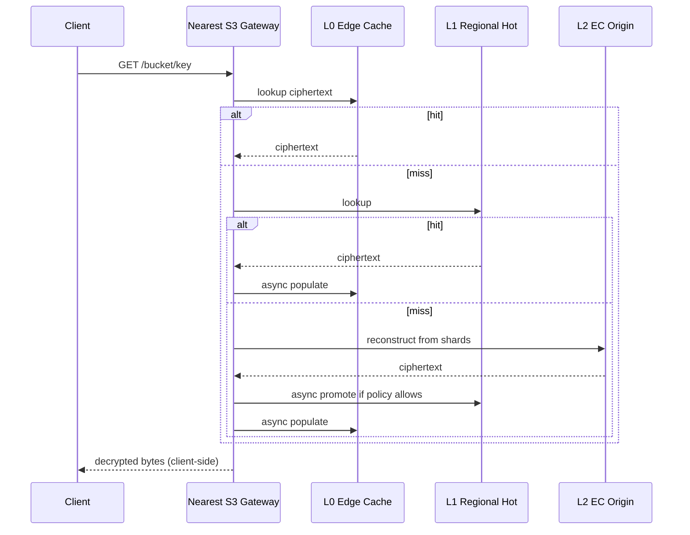
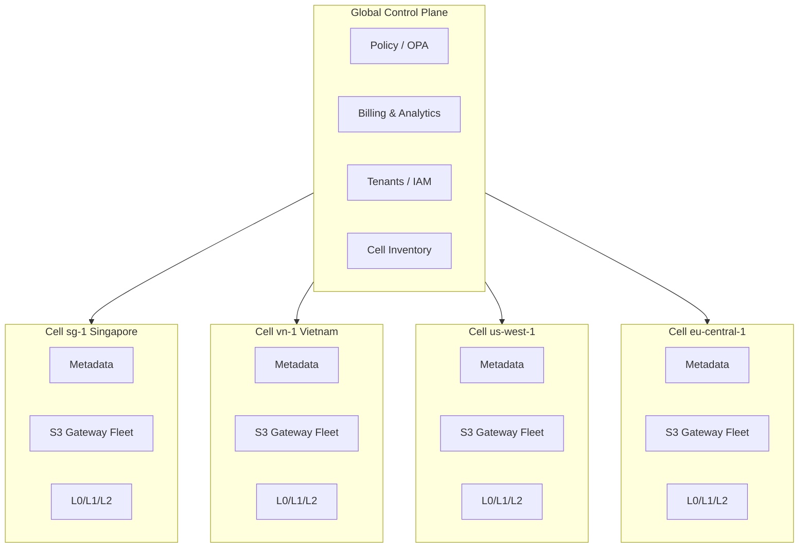

# Uney ZK Object Fabric — Technical Proposal

**License**: Proprietary — All Rights Reserved. See [LICENSE](../LICENSE).

> Status: Phase 1 — Architecture Proof. This document defines the target
> architecture, not the current implementation. See
> [PROGRESS.md](PROGRESS.md) for build status.

---

## 1. Executive Summary

- **What**: A multi-tenanted, zero-knowledge, S3-compatible object storage
  fabric with customer-controlled placement, erasure-coded durability,
  regional hot cache, and explicit bandwidth accounting.
- **Why**: The market leaves a gap. Wasabi is proprietary and centralized
  with opaque "fair-use" egress. Storj is open but its 80/29 erasure
  coding profile (tuned for untrusted peers) is too expensive for
  controlled DCs. Backblaze B2 and Cloudflare R2 are centralized and do
  not offer zero-knowledge by default. No existing product combines
  **ZK by default + customer-controlled placement + cache-aware pricing**.
- **How**: An S3-compatible API at the edge, a ZK gateway that encrypts
  client-side (per-object DEKs, encrypted manifests, optional CMK),
  a placement engine that enforces topology constraints, an
  erasure-coded durable origin (8+3 or 10+4), a regional hot replica /
  edge cache layer, and explicit per-tenant bandwidth accounting.
- **For whom**:
  - B2C: app developers who want cheap, private, S3-compatible storage
    behind an SDK and API key.
  - B2B: enterprises and sovereign customers who need dedicated cells,
    country/DC/rack-level placement, committed bandwidth, and SLAs.
- **License**: Proprietary. AGPL-licensed bases are ruled out for
  production. Ceph RGW (LGPL-2.1) and SeaweedFS (Apache-2.0) are the
  viable bases.

---

## 2. Market Analysis & Pricing

### 2.1 Competitive pricing landscape

| Provider                  | Public storage price           | Egress signal                           | Strengths                                    | Constraints                                            |
| ------------------------- | ------------------------------ | --------------------------------------- | -------------------------------------------- | ------------------------------------------------------ |
| Wasabi Hot Cloud Storage  | ~$6.99 / TB-mo                 | "Free" egress with fair-use policy      | Simple pricing, S3 API, large ecosystem      | Proprietary, centralized, opaque fair-use, no ZK       |
| Storj Regional            | ~$4.00 / TB-mo storage         | ~$7.00 / TB egress                      | Decentralized, S3-compatible, good SDKs      | AGPLv3 base, 80/29 EC is expensive in controlled DCs   |
| Storj Global              | ~$4.00 / TB-mo storage         | ~$7.00 / TB egress                      | Geo-distributed by design                    | Same license / EC constraints as Regional              |
| Storj Archive             | ~$1.00 / TB-mo storage         | Cold retrieval fees                     | Aggressive archive price                     | Retrieval cost & latency, AGPLv3                       |
| Backblaze B2              | ~$6.00 / TB-mo                 | ~$10.00 / TB egress (Cloudflare free)   | Mature, cheap, good ecosystem                | Centralized, no ZK, no customer-controlled placement   |
| Cloudflare R2             | ~$15.00 / TB-mo                | $0 egress to internet                   | Free egress, global edge                     | Higher storage price, no ZK, vendor lock-in            |

### 2.2 Pricing conclusion

Storage cost and bandwidth cost **must be separated** in Uney's pricing.
"Unlimited egress" marketing is disallowed; it forces cross-subsidization
that breaks at PB+ scale.

Viable Uney price targets by tier:

| Tier                  | Target storage price   | Egress model                          |
| --------------------- | ---------------------- | ------------------------------------- |
| ZK Archive            | $2.99–$4.99 / TB-mo    | Low / retrieval-priced                |
| ZK Standard (Basic)   | $4.99–$5.99 / TB-mo    | 1× stored included, then metered      |
| ZK Hot (Regional)     | $6.99–$9.99 / TB-mo    | 2–5× stored included if cacheable     |
| ZK Dedicated (PB+)    | Custom                 | Committed bandwidth contracts         |
| ZK Sovereign          | Premium                | Contractual, country/DC-constrained   |

**Key insight**: price the two resources separately and expose the cache
behavior to customers. Hot-tier discounts are honest only when cache hit
ratios are actually high.

---

## 3. Architecture

### 3.1 Control Plane

Responsibilities:

- Tenant, bucket, and object metadata (manifests, ACLs, versioning).
- Placement policies and policy evaluation.
- Node health, inventory, and failure-domain topology.
- Repair queues and repair scheduling.
- Billing counters (storage-seconds, PUTs, GETs, egress bytes).
- Abuse controls (rate limits, anomaly detection, CDN interaction).

Technology choices:

- **Metadata store**: FoundationDB, CockroachDB, or Postgres-Citus.
  Requirements: strong consistency, horizontal scale, transactions over
  small objects.
- **Billing / analytics**: ClickHouse for high-cardinality event
  ingestion and cost/SLA reporting.
- **Policy engine**: OPA / Rego for placement rules, egress budgets, and
  tenant guardrails.

Example placement policy (YAML, evaluated by OPA):

```yaml
tenant: acme-fintech
bucket: acme-vault
policy:
  encryption:
    mode: zk                  # client-side only
    kms: customer-managed
  placement:
    country: ["DE", "AT"]
    provider: ["uney-owned", "leaseweb"]
    min_dcs: 2
    min_racks: 6
    node_class: ["hdd-dense"]
    disk_class: ["cmr-enterprise"]
    carbon_profile: ["low"]
    sovereignty_tag: "eu-only"
  erasure_coding:
    profile: "10+4"
    stripe_mb: 4
  egress:
    monthly_budget_tb: 50
    burst_gbps: 5
    serve_from: ["l0", "l1"]
```

### 3.2 Data Plane

Three layers, each with a distinct function and storage format. All layers
below the ZK Gateway operate on ciphertext.

| Layer | Name                      | Function                                           | Storage format                                          |
| ----- | ------------------------- | -------------------------------------------------- | ------------------------------------------------------- |
| L0    | Edge Cache                | Serve hot reads with lowest latency                | NVMe, encrypted objects or chunks, LRU / LFU eviction   |
| L1    | Regional Hot Replica      | Serve bulk hot reads, absorb cache misses          | Full encrypted objects, 1–2 replicas in-region          |
| L2    | Durable Origin            | Durable storage of record                          | Erasure-coded shards across DCs / racks / nodes         |

**Why EC saves storage but not read bandwidth.** Erasure coding reduces
storage overhead from e.g. 3× (replication) to ~1.375× (8+3) or ~1.4×
(10+4). It does **not** reduce read bandwidth cost: each GET still
transfers the object bytes to the caller. That is why hot reads must be
served from L0 / L1 where the object is materialized and not
reconstructed from shards on every request.

### 3.3 Encryption Model

- **Per-object DEKs**: every object has a fresh data encryption key.
- **Encrypted manifests**: object manifests (shard lists, chunk hashes,
  sizes, offsets) are themselves encrypted so the operator cannot infer
  object structure from the metadata store.
- **Customer-managed keys (CMK)**: tenants may bring their own root key
  and rotate independently. Uney never stores plaintext root keys.
- **No plaintext keys at rest in the service**: DEKs are wrapped by the
  tenant's root key (which is client-side or CMK-held).

> **Warning — deduplication**: global cross-tenant deduplication is
> incompatible with ZK by default. Convergent encryption re-enables
> dedup but leaks content identity (equal plaintext → equal ciphertext).
> Uney's default is **no cross-tenant dedup**. A convergent-encryption
> bucket type may be offered opt-in for specific workloads (e.g. backup
> corpora) where the leak is acceptable.

### 3.4 Erasure Coding Model

EC profile selection is environment-dependent. Profiles below assume
Reed–Solomon (k + m) with failure domains spread across DCs / racks.

| Environment                            | Profile | Storage overhead | Notes                                                     |
| -------------------------------------- | ------- | ---------------- | --------------------------------------------------------- |
| Single controlled DC                   | 6 + 2   | 1.33×            | Cheapest; only survives 2 shard losses in one DC          |
| Two or three controlled DCs            | 8 + 3   | 1.375×           | Good balance for regional deployments                     |
| Larger multi-region deployments        | 10 + 4  | 1.4×             | Recommended default for ZK Standard / Hot / Archive       |
| Untrusted peer networks (Storj-style)  | 29 + 51 | 2.76×            | Needed only when nodes are adversarial / churny           |

**Recommendation**: start Phase 2 with **10+4** as the default and
**8+3** for single-region cells. Do not adopt Storj-style 80/29 — it is
tuned for untrusted peers and wastes capacity in controlled DCs.

### 3.5 Placement Control

Uney exposes a CRUSH-like topology:

```
world
└── region
    └── country
        └── dc
            └── room
                └── rack
                    └── node
                        └── disk
```

Exposure levels (customer-facing policy knobs):

- **country** — jurisdictional containment.
- **region** — latency / failure-domain grouping.
- **dc** — explicit facility list.
- **provider** — owned nodes, leased (e.g. Leaseweb, OVH, FDCServers), or cloud.
- **rack** — failure-domain spread within a DC.
- **node class** — HDD-dense, SSD-hot, NVMe-cache.
- **disk class** — CMR enterprise HDD, QLC SSD, etc.
- **carbon profile** — e.g. low-carbon-grid DCs only.
- **sovereignty tag** — compliance labels ("eu-only", "us-fedramp", etc).

### 3.6 Read Path & Promotion

Full read path for an S3 GET:



Promotion rules from L2 → L1 / L1 → L0 are evaluated per object and per
tenant:

- `monthly_read_egress(obj) > 0.2 × object_size` — the object is being
  read more than it is stored.
- `daily_reads(obj) > N` — configurable per tier.
- `p95_latency_miss > SLO` — latency-driven promotion.
- **Customer paid for hot tier** — tenants on ZK Hot default to
  L1-aggressive promotion; ZK Archive never promotes to L0.

### 3.7 Bandwidth Strategy

Bandwidth procurement is a first-class concern. Prefer flat /
high-commit providers:

- Leaseweb
- FDCServers
- OVH

For serving architecture, match the traffic shape to the layer:

| Traffic shape                                   | Wrong approach                                         | Correct approach                                                  |
| ----------------------------------------------- | ------------------------------------------------------ | ----------------------------------------------------------------- |
| Hot object reads                                | Reconstruct from EC shards on every GET                | Serve from L0 edge cache; populate on first miss                  |
| Regional users                                  | Cross-region reads from a single origin                | Place L1 hot replica in-region; pin locality by policy            |
| Range reads (video, archive chunks)             | Full-object reconstruct per range                      | Chunked storage; range-read from L0 / L1 without reconstruction   |
| Spiky public downloads (viral file, release)    | Serve directly from origin; pay burst egress           | CDN shielding in front of L0; origin-offload billing              |
| Cheap frequent egress on cold data              | Let GETs hit EC origin repeatedly                      | Promote to L1 after threshold; charge hot-tier; or decline promo  |

---

## 4. Multi-Tenancy Design

### 4.1 Per-tenant isolation

- **Encryption keys**: independent per tenant. CMK supported. No shared
  DEKs across tenants.
- **Placement policies**: bound to tenant (and optionally to bucket).
- **Egress budgets**: hard + soft caps, burst limits, monthly budgets.
- **Billing counters**: separate storage-seconds, request, and byte
  counters per tenant and per bucket.
- **Abuse controls**: rate limits, anomaly detection, throttling,
  reputation, and optional CDN shielding.

### 4.2 B2C model

- Shared ("pooled") cells.
- Self-service API keys and SDKs.
- SDK handles client-side encryption; plaintext keys never cross to Uney.
- Automated onboarding: signup → bucket → API key in minutes.
- Standard tier defaults (Standard or Hot).

### 4.3 B2B model

- Dedicated cells (physical or logical).
- Custom SLAs (durability, availability, latency).
- Sovereign placement (specific countries / DCs / racks).
- Committed bandwidth contracts.
- Custom EC profile per cell.

### 4.4 Tenant metadata schema (conceptual)

```yaml
tenant:
  id: t_01H....
  name: acme-fintech
  contract_type: b2b_dedicated     # b2c_pooled | b2b_dedicated | sovereign
  license_tier: standard           # archive | standard | hot | dedicated | sovereign
  keys:
    root_key_ref: cmk://acme/prod/root
    dek_policy: per_object
  placement_default:
    policy_ref: p_eu_strict
  budgets:
    egress_tb_month: 50
    requests_per_sec: 5000
  abuse:
    anomaly_profile: finance
    cdn_shielding: enabled
  billing:
    currency: USD
    invoice_group: acme-corp
```

---

## 5. Cell Architecture

### 5.1 Why not one giant cluster

- **Blast radius**: a bug, a repair storm, or an abuse event should not
  affect every tenant globally.
- **Repair complexity**: repair traffic scales badly when one cluster
  spans many regions.
- **Policy scoping**: sovereign tenants need hard boundaries, not "mostly
  EU" soft placement.
- **Billing and ops**: per-cell accounting simplifies cost allocation
  and capacity forecasting.

### 5.2 Cell sizing

A cell is **2–20 PB usable**. Below 2 PB the per-cell overhead
dominates; above 20 PB repair and failure domains get unwieldy.

### 5.3 Per-cell components

- Independent metadata shard (FoundationDB / CRDB region / Postgres-Citus shard).
- Repair queues scoped to the cell.
- Failure-domain topology pinned to the cell's DCs / racks / nodes.
- S3 gateway fleet sized to the cell's request volume.
- Billing counters rolled up to the global control plane.
- Placement inventory (which nodes, with which capacity, of which class).

### 5.4 Cross-cell replication

Cross-cell replication is **policy-driven, not automatic**. Tenants opt
in when they need multi-region durability or latency. Default is
single-cell placement.

### 5.5 Global control plane with regional cells



---

## 6. Open-Source Base Assessment

Uney uses a **proprietary license**. That rules out AGPL-licensed bases
because statically or dynamically linking Uney's proprietary service
code with AGPL code would force the combined work under AGPL terms.
Reference / study use is fine; production build on AGPL is not.

| Base         | License      | Maturity        | EC support              | Fit as Uney base             | Notes                                                                     |
| ------------ | ------------ | --------------- | ----------------------- | ---------------------------- | ------------------------------------------------------------------------- |
| Ceph RGW     | LGPL-2.1     | Very mature     | Yes (built-in)          | **Best durable-origin base** | Production-grade at EB scale. Operationally heavy but well understood.    |
| SeaweedFS    | Apache-2.0   | Mature enough   | Yes                     | **Best fast-build base**     | Fast to iterate on. Good permissive license. Active community.            |
| Storj        | AGPLv3       | Mature          | Yes (80/29 default)     | Ruled out (license)          | Excellent ZK / EC reference material. Cannot ship as production base.     |
| MinIO        | AGPLv3       | Mature          | Yes                     | Avoid                        | AGPL + recent maintenance / community concerns. Not a viable base.        |
| Garage       | AGPL-3.0     | Lightweight     | No (replication only)   | Small sovereign only         | Good for tiny cells, but no EC makes it unfit for PB-scale durability.    |
| Tahoe-LAFS   | GPL / TGPPL  | Stable, niche   | Yes (erasure in design) | Reference                    | Great ZK architecture reference; not a modern S3 base.                    |
| RustFS       | Apache-2.0   | Early           | In progress             | Watch                        | Permissive license; not yet production-ready. Revisit later.              |

> **Explicitly**: AGPL-licensed projects (Storj, MinIO, Garage) cannot be
> used as Uney's production base because Uney ships under a proprietary
> license. They are reference / study material only.

### 6.1 Recommended build paths

- **Option A — Fastest**: SeaweedFS (Apache-2.0) + Uney layers
  (encryption, placement, repair, billing, cache).
- **Option B — Most production-grade**: Ceph RGW (LGPL-2.1) + Uney
  layers (ZK gateway, placement abstraction, cache, policy API).
- **Option C — Research / fork**: Storj — **RULED OUT** as a production
  base because AGPLv3 conflicts with Uney's proprietary license.
  Retained as a reference implementation for ZK-style EC and peer
  coordination.

### 6.2 Decision criteria

| Requirement                               | Pick        |
| ----------------------------------------- | ----------- |
| Maximum production maturity at EB scale   | Ceph RGW    |
| Fastest time to a custom product build    | SeaweedFS   |
| Permissive licensing (non-negotiable)     | Ceph RGW or SeaweedFS |
| Strong peer-to-peer EC (reference only)   | Storj       |

---

## 7. Cost Architecture

### 7.1 COGS formula

```
cost_per_usable_TB_month =
    raw_disk_cost_per_TB_month × erasure_overhead
  + server_amortization_per_TB_month
  + rack_per_TB_month
  + power_per_TB_month
  + cooling_per_TB_month
  + operations_per_TB_month
  + repair_bandwidth_per_TB_month
  + metadata_cost_per_TB_month
```

- `erasure_overhead` is 1.33× (6+2), 1.375× (8+3), or 1.4× (10+4).
- Repair bandwidth is the dominant non-disk line item at PB+ scale and
  must be budgeted, not assumed free.
- Metadata cost scales with object count, not byte count.

### 7.2 Scale economics

| Scale       | Reality                                            | Implication                                              |
| ----------- | -------------------------------------------------- | -------------------------------------------------------- |
| 1 TB        | Pooled / automated infrastructure                  | Must be self-service; no manual support                  |
| 100 TB      | Ops-sensitive; a few customers move the margin     | Per-tenant monitoring, egress budgets, support tier      |
| 1 PB        | Dedicated storage nodes become viable              | Start moving large tenants off shared pools              |
| 10 PB+      | Owned HDD-dense nodes can undercut Wasabi per TB   | Win on price when bandwidth is committed                 |
| 1 EB+       | Cell architecture is mandatory                     | Multi-cell, cross-cell replication, repair federation    |
| Multi-EB    | Federation across cells and regions is mandatory   | Hardware procurement and DC strategy are core product    |

---

## 8. Competitive Positioning

### 8.1 At 1 TB (entry)

- Pooled infrastructure, no manual support.
- 1 TB minimum.
- Strict egress rules.
- Self-service signup.
- Automated abuse controls.
- **Entry offer**: $5.99 / TB-mo, 1× egress included, ZK by default.

### 8.2 At 100 TB – 10 PB (best zone)

This is Uney's strongest zone. Win on:

- Erasure coding on controlled nodes (8+3 / 10+4, not 80/29).
- Dedicated nodes or pooled-with-pinning.
- Regional cache layers.
- Committed bandwidth.
- Placement control (country / DC / rack).

### 8.3 At multi-million TB

This becomes an **infrastructure company problem**, not a software
problem. Needs:

- Multi-cell architecture.
- Hardware procurement pipeline.
- DC, power, and cooling strategy.
- Global peering and transit.
- Automated repair and drive replacement.
- Abuse, DDoS, and legal response operations.
- Observability stack (metrics, traces, logs at scale).
- Capacity forecasting and supply planning.
- Region-specific compliance (GDPR, HIPAA, FedRAMP, etc).

### 8.4 Where Uney wins

1. Zero-knowledge by default.
2. Customer-controlled placement.
3. Lower storage price for capped-egress workloads.
4. Better frequent-read economics via cache.
5. Dedicated cells for PB+ / sovereign customers.
6. Transparent egress pricing (no "fair-use" surprises).

---

## 9. Technical Risks & Mitigations

| Risk                                                      | Mitigation                                                                                             |
| --------------------------------------------------------- | ------------------------------------------------------------------------------------------------------ |
| Small-object overhead (metadata + EC per-object cost)     | Pack small objects into encrypted containers; index within the container manifest                      |
| Frequent uncached reads hammering EC origin               | Promote to L1 / L0 once thresholds cross; decline promotion on Archive tier                            |
| ZK metadata leakage (object names, sizes, access patterns)| Encrypt manifests; minimize object names in logs/metadata; pad sizes where practical                   |
| Deduplication vs ZK conflict                              | No cross-tenant dedup by default; convergent-encryption buckets offered only as explicit opt-in        |
| AGPL exposure from chosen base                            | Use Ceph RGW or SeaweedFS only; Uney is proprietary; AGPL bases (Storj, MinIO, Garage) are ruled out   |
| Repair storms saturating inter-DC bandwidth               | Rate-limit repair workers, prioritize by durability risk, schedule off-peak, cap per-link throughput   |
| Placement policy bugs (data in wrong country)             | Formalize constraints in OPA; test failure domains in CI; chaos-test placement under node loss         |
| Abuse traffic (viral files, DDoS, scraping)               | Per-tenant egress budgets, anomaly detection, CDN shielding, reputation-based throttling               |
| Durability marketing ("eleven nines") that can't be met   | Chaos testing, audit replays, measured durability — do not publish theoretical nines                   |

---

## 10. Product Tiers

| Tier          | Storage Price        | Included Egress    | Backend                         | Target                           |
| ------------- | -------------------- | ------------------ | ------------------------------- | -------------------------------- |
| ZK Archive    | $2.99–$4.99 / TB-mo  | Low / none         | 10+4 EC, HDD                    | Backup, compliance               |
| ZK Standard   | $4.99–$5.99 / TB-mo  | 1× stored          | 8+3 or 10+4 EC                  | Wasabi / B2 replacement          |
| ZK Hot        | $6.99–$9.99 / TB-mo  | 2–5× if cacheable  | EC + regional replicas          | SaaS assets, frequent reads      |
| ZK Dedicated  | Custom               | Committed BW       | Dedicated cell                  | PB+ customers                    |
| ZK Sovereign  | Premium              | Contractual        | Country / DC / rack-constrained | Regulated customers              |

All tiers are zero-knowledge by default. All tiers are S3-compatible.
All tiers expose placement policy; Archive and Standard use sensible
defaults, Hot and Dedicated expect customer configuration, Sovereign
requires it.
